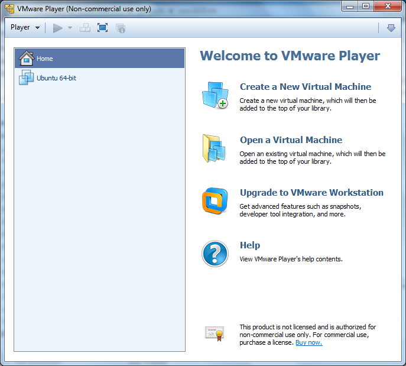
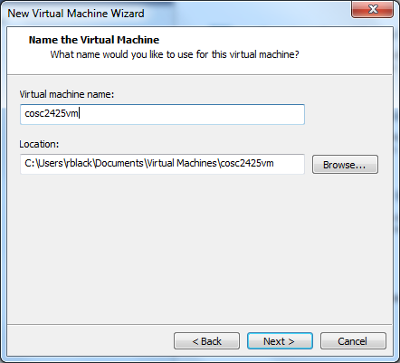
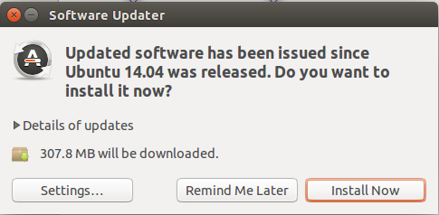

.. _installing-ubuntu-desktop:

Setting Up the Class VM
#######################

..  include::   /references.inc

The new VMware_ Player tool is pretty smart. It will detected the version of
Linux being installed, and pretty much automates the entire installation
process. All you need to do is sit and wait for it to finish.

Start up the VMware_ Player program:

Next, click on the :menuselection:`Create a New Virtual Machine` link:

..  image::     VMsetup2.png
    :align: center

In this window, you will need to browse your system to find the `.iso` file you
downloaded. Once that is selected, you should see the system detect the OS you
are going to install. Click :menuselection:`Next` to continue.

..  image::     VMsetup3.png 
    :align: center

In this screen you will enter information for the administrator of the system.
This user has full control of the OS, something that is much safer to play with
here, rather than on a real server!

Enter your name, user name, and password, then click on :menuselection:`Next`
again.

Here, we give the system a name, and indicate where you want to store the
files. Do not put this folder on your desktop. Select some place out of the way
on your system.

Click :menuselection:`Next` yet again.

..  image::     VMsetup5.png
    :align: center

On this screen, you select the size of the virtual hard disk you want. For a
server, this can be around 10GB, but for a :term:`GUI` desktop version, 40GB
seems about right. This disk image will be stored in a file on your system, and
it will start off fairly small and grow as you add software to the system. 

One more :menuselection:`Next`:

..  image::     VMsetup6.png
    :align: center

Here, you get to review the settings so far There is an option to customize the
hardware here, and we need to do that to set up the memory required for this machine:

Click on the :menuselection:`Customize Hardware` link:

On this screen, you will decide how much of your system's memory you want to
dedicate to the :term:`VM`. For a server this can be as small as about 512MB,
but for a desktop, I recommend around 1GB. (You should have a minimum of around
4GB on your system to run the :term:`VM` so this is not going to slow the rest
of the system very much.

Click :menuselection:`Close` when you have the setting in place:

..  image::     VMsetup8.png
    :align: center

Finally, we can turn the installation loose!. The OS should install unattended
and eventually show you a login screen:

..  image::     VMsetup9.png
    :align: center

Use the credentials you set up earlier to log in to your new machine. 

Updating the system
*******************

It is quite possible that the system you installed is not up to date. After the
basic installation, and after you log in, you may see a pop-up screen offering
to update the system:

The first time you do this, it will take a while. There are many packages on
the system, all of which undergo updating by the thousands of open-source
developers whose work you are benefiting from!

Let this proceed and you will have an up-to-date system. You can update things
as often as you like after you get the system running.

The next step is to learn a bit about operating this system. There are many
good guides to Ubuntu_ Linux on the Web, but we will be spending most of our
time working with the :program:`Terminal` program, so we will learn about that
next!
