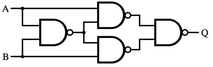

..  _basic-digital-gates:

Basic Digital Gates
###################

..  include::   /references.inc

The connection between Boolean Algebra and Digital Circuits can be seen in the
fundamental building blocks of modern computer systems.

AND gates
*********

The symbol for an **AND** gate looks like this:

..  circuits::
    :align: center
    :tikzopts: circuit logic US
    :tikzlibs: circuits.logic.US,calc

    \node (b) at (0,-1) {$B$};
    \node (a) at (0,0) {$A$};
    \node (out) at (3,-0.5) {$OUT$};

    \node[and gate] at ($(a)+(1.5,-0.5)$)(and1) {};

    \draw (a.east) -- ++(right:3mm) |- (and1.input 1);
    \draw (b.east) -- ++(right:3mm) |- (and1.input 2); 
    \draw (and1.output) -- (out.west);

Electrically, it works like this:

..  circuits::
    :align: center
    :tikzlibs: circuits.ee.IEC
    :tikzopts: circuit ee IEC, set make contact graphic= var make contact IEC graphic

    \node[make contact,info=$A$] at (1,0) (sw1) {}; 
    \node[make contact,info=$B$] at (2,0) (sw2) {}; 
    \node[bulb,info=$OUT$] at (3,0) (b1) {};
    \node[ground,rotate=-90] at (0,-1) (g1) {};
    \node[ground,rotate=-90] at (4,-1) (g2) {};

    \draw (g1.input)  to[battery] (0,0) -- (sw1.south west);
    \draw (sw1.south east) -- (sw2.south west);
    \draw (sw2.south east) -- (b1.input);
    \draw (b1.output) -- (4,0) -- (g2.input);

That funny symbol with the "X" in it indicates a lamp, which tells us the
output state.  The switches are normally open, indicating a "0", and when
pressed indicate a "1".  It should be obvious that both switches need to be
pressed to light the light. 

You should examine the truth table for **AND** and convince yourself that they
are equivalent.

OR Gates
********

Here is the symbol for the **OR** gate

..  circuits::
    :align: center
    :tikzopts: circuit logic US
    :tikzlibs: circuits.logic.US,calc

    \node (b) at (0,-1) {$B$};
    \node (a) at (0,0) {$A$};
    \node (out) at (3,-0.5) {$OUT$};

    \node[or gate] at ($(a)+(1.5,-0.5)$)(and1) {};

    \draw (a.east) -- ++(right:3mm) |- (and1.input 1);
    \draw (b.east) -- ++(right:3mm) |- (and1.input 2); 
    \draw (and1.output) -- (out.west);

And here is the equivalent simple circuit:

..  circuits::
    :align: center
    :tikzlibs: circuits.ee.IEC
    :tikzopts: circuit ee IEC, set make contact graphic= var make contact IEC graphic

    \node[make contact,info=$A$] at (1.5,0.5) (sw1) {}; 
    \node[make contact,info=$B$] at (1.5,-0.5) (sw2) {}; 
    \node[bulb,info=$OUT$] at (3.25,0) (b1) {};
    \node[ground,rotate=-90] at (0,-1) (g1) {};
    \node[ground,rotate=-90] at (4,-1) (g2) {};

    \draw (g1.input)  to[battery] (0,0) -- ++(right:6mm) |- (sw1.south west);
    \draw (0,0) -- ++(right:6mm) |- (sw2.south west);
    \draw (sw1.south east) -- (2.5,0.5) -- (2.5,0) -- (b1.input);
    \draw (sw2.south east) -- (2.5,-0.5) -- (2.5,0);
    \draw (b1.output) -- (4,0) -- (g2.input);

Here it should again be obvious that pressing either switch will light the
lamp. Just like the **OR** truth table said it would!

NOT Gate
********

Here is a simple digital gate that implements the *complement* action: 

..  circuits::
    :align: center
    :tikzopts: circuit logic US
    :tikzlibs: circuits.logic.US,calc

    \node (a) at (0,0) {$IN$};
    \node (out) at (3,0) {$OUT$};

    \node[not gate] at ($(a)+(1.5,0)$)(not1) {};

    \draw (a) -- (not1.input);
    \draw (not1.output) -- (out);

Another name for this component is an *inverter*.

..  note::

    That small circle on the right of this triangle is the indicator that the
    signal has been inverted. You will see a small circle on other components,
    and it always flips the signal.

NAND Gates
**********

In digital systems, application of the identities shown in the last section led
to the discovery that creating one more component would be extremely useful. By
adding an **NOT** gate to the ouput of the **AND** gate, we create a new gate,
the **NAND** gate:

    
..  circuits::
    :align: center
    :tikzopts: circuit logic US
    :tikzlibs: circuits.logic.US,calc

    \node (b) at (0,-1) {$B$};
    \node (a) at (0,0) {$A$};
    \node (out) at (3,-0.5) {$OUT$};

    \node[nand gate] at ($(a)+(1.5,-0.5)$)(nand1) {};

    \draw (a.east) -- ++(right:3mm) |- (nand1.input 1);
    \draw (b.east) -- ++(right:3mm) |- (nand1.input 2); 
    \draw (nand1.output) -- (out.west);

The truth table for this component looks like this:

..  csv-table::
    :widths: 10,10,10,10
    :header:  Op, in1, in2, out

    **NAND**, 0, 0, 1
    , 0, 1, 1
    , 1, 0, 1
    , 1, 1, 0

It turns out we can build all the other basic gates using just this one new
gate. This has big implications in manufacturing modern computers since the
template for a single **NAND** gate can be duplicated many times and each gate
interconnected into a system that represents just about any digital circuit you
can think of!

NOT gate
========

Here is how we build an inverter out of a **NAND** gate:

..  circuits::
    :align: center
    :tikzopts: circuit logic US
    :tikzlibs: circuits.logic.US,calc

    \node (a) at (0,0) {$A$};
    \node (out) at (4,0) {$OUT$};
    \node[nand gate] at (2,0)(nand1) {};

    \draw (a) -- (0.5,0) -- ++(right:0.5cm) |- (nand1.input 1);
    \draw (0.5,0) -- ++(right:0.5cm) |- (nand1.input 2);
    \draw (nand1.output) -- (out);

Exclusive OR
************

We neglected one column in the truth table we showed earler. The **XOR**
operator (exclusive or). 

..  circuits::
    :align: center
    :tikzopts: circuit logic US
    :tikzlibs: circuits.logic.US,calc

    \node (b) at (0,-1) {$B$};
    \node (a) at (0,0) {$A$};
    \node (out) at (3,-0.5) {$OUT$};

    \node[xor gate] at ($(a)+(1.5,-0.5)$)(xor1) {};

    \draw (a.east) -- ++(right:3mm) |- (xor1.input 1);
    \draw (b.east) -- ++(right:3mm) |- (xor1.input 2); 
    \draw (xor1.output) -- (out.west);

Here is a circuit that actually implements the **XOR**
function using only **NAND** gates. 

Circuit Math
************

Here is a fairly simple *boolean expression*

..  math::

    z = (x_0 \cdot x_1 \cdot \neg x_2) + (x_0 \cdot x_1 \cdot x_2) + (x_0 \cdot \neg x_1 \cdot x_2) + (\neg x_0 \cdot x_1 \cdot x_2)

And here is the moderately complex circuit that implements that formula.:

..  circuits::
    :align: center
    :width: 600
    :tikzopts: circuit logic US
    :tikzlibs: circuits.logic.US,calc

    % nodes
    \node (x0) at (1,0) {$x_0$};
    \node (x1) at (2,0) {$x_1$};
    \node (x2) at (3,0) {$x_2$};

    \node[not gate, rotate=-90] at ($(x0)+(0.5,-1)$) (Not0) {};
    \node[not gate, rotate=-90] at ($(x1)+(0.5,-1)$) (Not1) {};
    \node[not gate, rotate=-90] at ($(x2)+(0.5,-1)$) (Not2) {};

    \node[and gate, logic gate inputs=nnn] at ($(x2)+(3,-2)$) (And0) {};
    \node[and gate, logic gate inputs=nnn] at ($(And0)+(0,-1)$) (And1) {};
    \node[and gate, logic gate inputs=nnn] at ($(And1)+(0,-1)$) (And2) {};
    \node[and gate, logic gate inputs=nnn] at ($(And2)+(0,-1)$) (And3) {};
    \node[or gate, logic gate inputs=nnnn, anchor=input 1] at ($(And1.output -| And2.output)+(3,-0.25)$) (Or0) {};

     % draw nodes
    \foreach \i in {2,1,0} {
        \path (x\i) -- coordinate (punt\i) (x\i |- Not\i.input);
        \draw (punt\i) node[branch] {} -| (Not\i.input);
    }

    % direct inputs
    \draw (x0 |- And2.input 1) node[branch] {} -- (And2.input 1);
    \draw (x0) |- (And3.input 1);
    \draw (Not0.output |- And0.input 1) node[branch] {} -- (And0.input 1);
    \draw (Not0.output) |- (And1.input 1);
    
    \draw (x1 |- And0.input 2) node[branch] {} -- (And0.input 2);
    \draw (x1 |- And1.input 2) node[branch] {} -- (And1.input 2);
    \draw (x1) |- (And3.input 2);
    \draw (Not1.output) |- (And2.input 2);
    
    \draw (x2) |- (And1.input 3);
    \draw (Not2.output |- And0.input 3) node[branch] {} -- (And0.input 3);
    \draw (Not2.output |- And2.input 3) node[branch] {} -- (And2.input 3);
    \draw (Not2.output) |- (And3.input 3);
    
    % AND
    \draw (And0.output) -- ([xshift=0.8cm]And0.output) |- (Or0.input 1);
    \draw (And1.output) -- ([xshift=0.5cm]And1.output) |- (Or0.input 2);
    \draw (And2.output) -- ([xshift=0.5cm]And2.output) |- (Or0.input 3);
    \draw (And3.output) -- ([xshift=0.8cm]And3.output) |- (Or0.input 4);
    \draw (Or0.output) -- ([xshift=0.5cm]Or0.output) node[above] {$z$};

    
