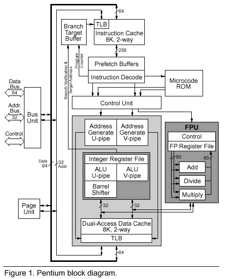
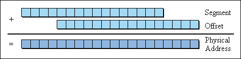
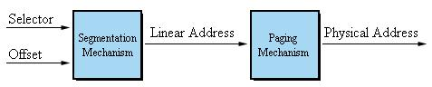
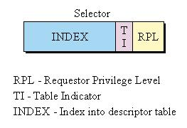
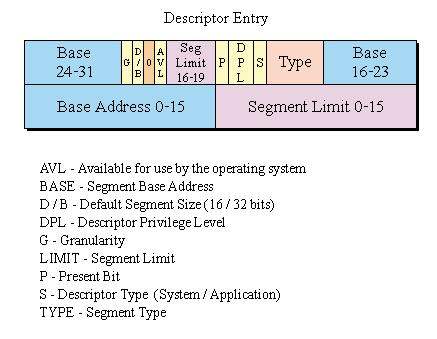
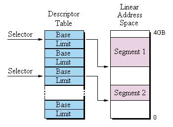

..  _pentium-intro:

..  include::   /references.inc

Inside the Pentium
##################

The Pentium is a complex beast. As we discussed in class, the modern
microprocessor has many features on the chip that help it perform the tasks we
want it to perform. 

Chief among them is to allow more than one job to run in a system at the same
time - well, what seems to be at the same time! 

How is this magic feat accomplished, and what does it all mean to me - the
assembly language programmer? The answer to the first question is sophisticated
memory management and time slicing and to the second is not a lot - unless you
want to write an operating system!  We will look at memory management today and
time slicing later in the course. 

Processor Modes
***************

The Pentium operates in several *modes*. 

* ``Real Mode`` (it thinks it is 1985)
* ``Protected Mode`` (OK, it is now!)

Why this happens is something you need to ask Intel about.

(It has something to do with legacy code!)

When it first wakes up (when power is applied) it starts off in something Intel
chooses to call `Real Mode` which makes it run the way the old 8086 processor
ran. (Why? - Ask Intel about how it feels about backward compatibility!) 

Real Mode
*********

The first PC had an Intel 8086 chip in it!

* The 8086 was a 16 bit processor
 
* Intel wanted to give it ONE MEGABYTE of memory
    * (more than enough - Bill Gates once said!)
     
* Problem! It takes 20 bits to address one megabyte!
 
The Segmented mess!
*******************

Intel designed a clever way of making a 16 bit processor handle 20 bit
addresses. They came up with the concept of using two 16 bit address components
called a segment and an offset, and a bit of hardware to generate the 20 bit
address. 

Which worked like this:

Inside the chip, the hardware that manages converting two 16 bit quantities
into a single 20 bit address that is placed on the address bus to reference
physical memory. (Slide the 16 bit segment value over to the left 4 bits and
add in the low 16 bit part to get 20 bits.) 

What is a segment?
******************

* Upper 16 bits is called a ``segment``
    * It points to a 16 byte block called a ``paragraph``

* The low 16 bits is called an ``offset``
    * it measures how far from the ``segment`` start point we are
    * It can access 64 kilobytes of memory

The problem with this was that one real location in memory can be reached by
hundreds of different combinations - what a mess!

Inventing modes
***************

* Soon it was obvious that one megabyte was not enough!
    * Bill had the keys to the car by now!

* Intel also wanted to be able to load more than one program in memory
    * without letting them step on each other!
    * without needing to change the programs depending on where they landed

* They also did not want to mess up all the existing programs!
    * Too many folks would yell at them (IBM for one!)

When it became apparent that 20 bits was not going to be sufficient for modern
systems (and Microsoft started building bigger and bigger programs) Intel went
back to the drawing board and came up with yet another way to generate an
address - this time a 32 bit address. They also introduced a new mode for the
processor: 

Protected Mode
**************

The new mode, `Protected Mode`, was designed to allow one program to be
protected from other programs physically loaded into memory at the same time.
Intel wanted to do this in a way that would allow each program to think it
owned the entire machine, but actually did not! Let's look at how they
accomplished this magic. 

Intel introduced a new hardware component to the chip - a ``paging unit``.

Now the generation of a physical address looks like this: 

* In this machine (80386) all internal work was done in 32 bit chunks!
    * Now we can reach 4 GIGABYTEs of memory
    * Big enough now, Bill? (apparently not!)

These two internal hardware components are separate and can be activated and
disabled under programmer control by setting a single bit inside the chip! As
we will see later, the Pentium wakes up in `Real Mode` and pretends to be a
simple 16 bit machine. In this mode, the code in the `BIOS`, (**Basic I/O
System**) is run to check the health of the machine, and then an operating
system is loaded. As part of this loading process, the processor is switched
into `Protected Mode` and the full power of the machine is available to lay out
program and data areas as needed.  Basically, the operating system is the only
part of the code in the machine with full access to all the capabilities of the
processor. Once it runs a user program, that program has limited capabilities -
to protect the rest of the programs that may be loaded in the machine at the
same time.

In `Protected Mode`, we are running as a full 32 bit machine. In this mode, the
`segment` and `offset` scheme really are not necessary since all addresses in
the machine are 32 bits big. As a programmer, we can just think of addresses as
simple 32 bit numbers.

The real goal of these internal changes is to allow the processor to set up
programs in such a way that one program can be isolated from other programs in
memory.  Physical memory in the system to be broken up into blocks and the
processor can protect each block from each other block.  Blocks of memory can
be set up with program code, data, or whatever we want. The blocks can even be
locked so that the contents of the block cannot be modified after the program
starts running! These hardware features allow the operating system to keep any
program from stomping on another program!  The worst that can happen in this
design is that a program can get so confused that it commits suicide, while all
of the other programs continue about their business unaffected. 

Controlling access to Memory
****************************

* This is the world of the operating system, not the user!

* Tables are set up by the OS to manage the allocation of memory

* Instead of selectors and offsets, they moved to 
    * Selectors (new style)
    * Descriptors

The scheme Intel  has come up with for managing physical memory is fairly
complicated, and we will not need to understand it in detail. But is is useful
to look at the basic way things are done to get a feel for how physical memory
is being managed. 

Basically, the processor uses a number of tables that are set up by the
operating system, to control things. 

Selectors
*********

The operating system builds a data structure called a ``descriptor table`` (in
memory the operating system controls) that sets up all of the blocks needed by
the various programs loaded in physical memory at any time. It also maintains a
list of `selector` data structures which set up access to a particular
`descriptor`. The `selector` contains bits that restrict access to the block to
programs running at one of several `privilege levels`. Intel set up this scheme
to allow programs to be run with limited access to certain internal features.
Programs run at one of these levels as assigned to them by the operating
system, and can access more features of the processor as the privilege level
rises. Guess what? The operating system runs at the highest privilege level,
and lowly users run at the lowest levels. All part of Intel struggle from
keeping programs under proper control!

The ``selector`` is basically used as an index into a ``descriptor table``.

* Notice that ``privilege`` area, we can decide who can do what!

(If all of this is confusing, just be glad that we do not usually need to
play with any of this unless we are writing an operating system!) 

Descriptors
***********
 
The ``descriptor`` contains information needed to maintain proper
control of a single block of memory:

If you look closely at this structure, you will see a base address (broken up a
bit - but 32 bits wide, and a size specification. We will not worry about all
the other stuff in the `descriptor` because it is not important to us at the
level we will work in this course.

Setting up memory blocks
************************

Here is basically how the system manages memory with these tables:

Now this is really nice. As the operating system loads programs, it sets up
several blocks of memory in the physical memory wherever it can find room and
updates the tables. As the program runs, it thinks it owns the entire machine
and the memory looks like a simple array of bytes that starts at an address of
zero. The processor takes care of mapping the program's address references to
the real physical memory in the system. Any attempt to access an address
outside of the assigned space will cause the processor to generate a signal
that something is wrong. This signal is processed by the operating system and
usually you get one of those funny pop-up error messages to tell you you
program has gone bye-bye! 

Using this scheme, the operating system can keep programs from accessing each
other's memory. In the old days if you wrote a bad program it could kill the
entire computer and all you could do was turn the silly thing off and try
again! 

Virtual memory 
**************

* There is one more layer in all of this. 

* there will never be enough memory!
 
* Where can we get more storage?
    * How about using the disk
    * OK, so it will be slow!
    * We will have TONS of space now

Basically, the operating system can track how the blocks are being used by a
program, and blocks that are not being used can be copied out of the system to
the hard disk, freeing up memory for other programs to use. When the program
attempts to access memory that has been moved out of the system, the processor
generates a signal that will cause the operating system to recreate that block
and restore the data that was there earlier - updating the tables as needed.
The effect of all of this is that only those blocks that are really active at
any moment really need to be in the system's memory, the other blocks remain on
the hard disk. As long as all of this happens pretty fast the program can run
in a much smaller space than it actually needs. The blocks on disk are called
`virtual memory`.

There is one problem with all of this. Suppose you set up a program in such a
way that the operating system must copy part of it to disk, and you immediately
want it back. We can get into a state called `thrashing` where the system
copies blocks back and forth constantly - bringing things to a crawl! (You can
tell when this happens, the program will suddenly run really slow, and the
drive activity light on your systems stays lit constantly!)

What goes on inside the chip is a bit more complicated that what we have
just explained, but you should get the basic idea. 

