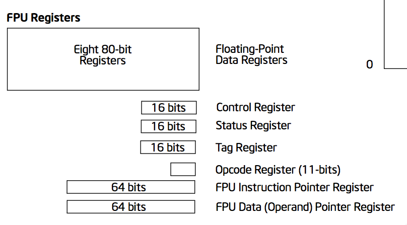

..  _simple-assembly:

Simple Assembly Language
########################

We looked briefly into the inner workings of the Pentium in a previous
lecture. This time, we want to explore the parts of that machine we need to
pay attention to in order to write programs for this processor.

Since we are ready to begin exploring building assembly language programs in
detail, you will need to have access to reference material describing the
actual processor that is our target machine. So, we will begin looking over the
available documentation from Intel. (AMD has similar material as well).

Intel references
****************

One of the first things an assembly language programmer does when faced
with writing code for a new processor, is to dig into the chip
documentation. For our course, we are focusing on the Intel IA-32 chip
line. The documentation for this line is found on the `Intel web site here
<http://www.intel.com/design/pentium4/documentation.htm>`_. The current
documentation covers both the 32 bit and 64 bit systems produced by Intel.

Intel recently changed all their documentation around. All the material
for the modern Pentium is now available in a single 4600 (!) page PDF file!

    * :download:`PentiumDocs.pdf`

This file contains the references needed by both hardware and software
folks seeking to use this family of processors. The manuals include a  `Basic
Architecture Manual`, and `Programmers` manuals detailing every
instruction available in the processor. 

Fortunately, programming these beasts in assembly language is not that
hard, since the most important instructions are pretty simple to
understand. The C/C++ compilers seldom use many of the available
instructions, making one wonder why they are still included in the chip. Special
applications, and libraries can and do use them, so they are detailed
here as well.

I found another reference that looks interesting while browsing the
Intel documentation. This is an overview of 64-bit programming, but it
targets Windows developers:

    * :download:`Introduction_to_x64_Assembly.pdf`

I recommend downloading this file, and browsing it to get a feel for the
information found here. 

Basic Intel Architecture Manual
===============================

The architecture manual describes the basic chips in the Pentium family. It
includes a discussion of the history of the Intel chip features all the way
back to the 8086 chip used in the original IBM-PC. We are mostly concerned with
the chips that power most of today's computers - the Pentium 4 family.

The architecture manual covers the technical features of the chip, in far more
depth than we really need to worry about. It is valuable reading for those of
you who push to the frontier of making the chip really sing, but for us
beginners, it is overkill!

Programmer's Manuals (Vol 2A and 2B)
====================================

The next two manuals are important references on the instruction set of the
Pentium. Volume 2A covers instructions beginning with A-M, and Volume 2B
covers N-Z. These manuals give you a great deal of detail into how the
Pentium instructions work. One interesting aspect of these references is
that they include a definition of how each instruction works in an almost
mathematical manner. It is this level of detail that helps others build
interpreters that operate the exact way the Pentium does, but in software,
not hardware. The detail also allows other hardware manufacturers create
chips that use the exact same instruction set (Hmmm - AMD?)

Here is an example of the description you will see for a simple instruction
that adds two values:

..  code-block:: bash

    ADD     DEST, SRC

    Operation

    DEST <-- DEST + SRC;

Programmers model of the processor
**********************************

The most important part of these manuals is actually in the Architecture
manual. The intricate details about the architecture are interesting if you
intend to build a machine that uses the Pentium processor. However, that
part that a programmer needs to understand is much simpler. We need to
identify the components of the chip that we will need to control to make
the chip run a program. 

Most of our programming will be done with the processor running in `protected
mode`. In this mode, the memory allocated to the program looks like a simple
linear block of bytes that we can access using a simple 64 bit address. Since
no physical computer could ever have that much memory, the chip only supports a
physical address space that uses 40 bits. Even that is not likely to happen
unless memory prices really fall. For our purposes, we can pretend that our
program is running in a pure computer with nothing else going on except our
program and that we have total control of the computer!

But you know better!

Programmer's resources
======================

Intel calls the environment we will be most concerned with the ``execution
environment``. There is such an environment for programs running in 32-bit
mode, and another for those machines running 64-bit programs. We will focus on
the 64-bit environment.

The assembly language programmer is most concerned with those resources inside
the chip that must be managed to make the chip perform its tasks. The Pentium
has a number of special memory locations inside the chip - each of which is
called a `register`. These are just 64-bit wide memory-like
containers where binary data can be placed temporarily while work goes on.
Some of these registers are used by specific instructions, and we must set
things up before we ask the processor to execute those instructions. Others
are available for any use you can think of. Because these `register`
devices are inside the chip, data manipulation involving them is as fast as
is possible in the processor. Any instruction that accesses external memory
will be substantially slower!

Here is a general view of the most important `register` set we will be working with:

In addition, there are two more sets of registers in the chip, but we will not
use these much in this course:

These registers are actually in the Floating Point unit within the chip.

And these are special registers used for advanced "parallel" operations. We
will look at these registers later in the course:

..  image:: MMXRegisters.png
    :align: center

Segment Registers
-----------------

In the basic register diagram, you see four register sets. The set labeled
*Segment Registers* will not concern us much. Some of those registers are used
by the operating system for memory control, and others are there for writing 16
bit code compatible with the old 8086 processor. For the most part we will not
write programs that use any of these registers.  

General-purpose Registers
-------------------------

The set labeled `General purpose registers` is where we work the most.
This is prime real estate! As we said before, some of these registers are
used in very specific ways, and we will go over all of that as we introduce
the appropriate instructions.  

There are a total of 16 general purpose registers in the chip. They have these names:

* RAX, RBX, RCX, RDX, RDI, RSI, RBP, RSP, R8-R15

We will go over this naming scheme in more detail later. 

Four of these registers have several alternative names you can use to work with
different size data items. Unfortunately, sometimes you might forget how this
works and think you have more registers than you really have. The registers
with this odd naming scheme are :

* **RAX**
* **RBX**
* **RCX**
* **RDX**  

Here is the pattern:

* **RAX** refers to the entire 64 bit register
* **EAX** refers to the low 32 bits of **RAX**
* **AX** refers to the low 16 bit part of **RAX**
* **AL** refers to the low 8 bits of the **AX** register
* **AH** refers to the high 8 bits of the **AX** register

Phew! You might be asking yourself if any other parts of the **RAX** register
have special names - sorry, it isn't so! Most of these names are holdovers
from the old 8 bit microprocessors Intel produced back in the 1970's!

Status registers
----------------

The last set of registers is very important. The processor records a variety
of bits of information after each instruction is completed in the `Flag
Register`. These bits help us figure out what happened when that instruction
did its work. We will be examining various bits here with our program to
decide what to do.

The Instruction Pointer
-----------------------

There is one more register here, though, that is especially important. The
register labeled **RIP** is the `instruction pointer` which holds the
memory address of the *next* instruction to execute in your program. As each
instruction is processed, the **RIP** register is adjusted so the processor
knows where the next instruction will come from. Each instruction takes a
variable number of bytes, so even if the next instruction is literally next in
memory, the calculation is still hard to do. Furthermore, the instruction may
want to direct the processor to some other point in memory. In this case, the
contents of **RIP** will be changed as the instruction executes. Once **RIP**
has a new value, the program will branch to that point and fetch the next
instruction and continue on from there. 

Introducing Assembly Language
*****************************

Finally, we are ready to start looking at assembly language in detail!

The only language the CPU actually understands is `Machine Language` -
the actual binary bits the system can load and process. It is possible to
program computers at this level (we did on the first home computer systems),
but it is exceedingly tedious and error prone.

And, just plain DUMB!

Assembly Language - designed to help humans work with the systems, is much
easier!

What is an Assembly Language Instruction?
=========================================

Every line in an assembly language program directs the assembler to do some
fairly simple action. Most of the lines define instructions we want the CPU to
process. The assembly language instruction is just a symbolic code for a
machine instruction - usually, a code designed to help us poor humans figure
out what will happen.

The code is called a `Mnemonic`. 

..  note::

    The code is usually a simple set of characters that are designed to help
    you remember what the instruction does. The term `OpCode` is used frequently
    when dealing with assembly language, but that refers to the actual machine code
    (presented in binary or hex) produced by the assembler for a specific
    instruction. 

An instruction may require additional information which comes in the form of
`Operands`. For example:

..  code-block:: bash

    MOV     EAX, EBX 

The mnemonic here is **MOV**, the operands are **EAX** and **EBX**.

Basically, each assembly language instruction corresponds to a single
machine instruction.

Planning our programs
*********************

We will be following a fairly simple process to build a runnable program
from our assembly language programs. Here is a simple schematic of the
process:

This should look familiar, we discussed much of this in our introduction to
**Make**.

Some new things to consider
===========================

You have had experience building programs before, but since those programs
were in high-level languages, and were possibly developed in integrated
development environments, you might not have managed all the steps to
produce a runnable program yourself.

Add to that, you now need to watch over properly setting up your program so
the operating system can run it and regain control when you are done!

All of the normal issues you face in developing a program still will be
present in assembly language. However, you get to take on some of the
responsibilities your high-level languages managed for you. For example:

* How do I set up constants?
* Where do I put the data?
* How do I create data structures?
* What instructions are available and how do I use them?
* How do I package code blocks into subprograms?
* How do I make my program return control to the OS when it is done?

Phew, a lot of detail to think about!

The Assembler will help, but you are still in charge!

The Assembler's Job
===================

The Assembler program will read the text of your program. It will keep
track of the memory addresses that will be used for the instructions you
define on every line of code, and every piece of data you define. It will
manage creating an `object file` suitable for linking with other parts to
produce a properly formed executable file for the specified operating
system.

The Assembler's primary job is to build that `object file` which is
close to an executable file, but is missing code that the operating system
needs to allow your program to load and run, and may be missing routines that
live in other object files, or libraries of code we may need to use.

The Linker's Job
================

After you build one or more object files, you need to merge them with one
or more `library` files which contain other routines you may be using
to produce the executable program file. The Linker manages this process.
If everything needed can be located, the parts are stitched together and an
`executable file` is produced.  This file is not actually ready to
run, instead, it is a data file used by the `loader` program that the
operating system uses to load programs in memory and make them ready to
run. (We will discuss the structure of the executable file in our next
lecture).

The Structure of an Assembly Language Program
**********************************************

Your programs will be made up of three basic kinds of constructs:

* Comments - beginning with a semicolon, ending at the end of line
* Instructions - Labels, Mnemonics, and Operands
* Directives - instructions to the assembler

Comments
========

Comments are ignored by the assembler. You should include comments to
explain what your program is trying to do. Good comments take thought, and
will help everyone who needs to understand your code later.

There are two kinds of comments:

* Full line - place a semicolon in the first column and use the rest of the
  line for your comment text

* Partial line - after an instruction place a semicolon and use the rest of
  the line for your comment

It is quite common to comment most instructions in an assembly language
program. But do not fall into the habit of doing so! Use comments ONLY
where they are needed to explain what is not obvious in your code. (I will
admit to commenting almost every line when I was first trying to learn
assembly language on the Cray-1, but I soon got over that need and reduced
the comment count significantly!)

Place a standard header at the top of your program to identify who wrote
the program, when, and why. This is good practice for any program!

Instruction Statements
======================

Instruction statements must follow the manufacturer's (actually, the assembler
writer's) conventions. You will include instruction mnemonics in these
statements, and any required operands as specified by the manufacturer. We will
use code tables, or handbooks to determine what mnemonics are available and
what each means.

Directives
==========

Each Assembler program includes a number of ``directives`` that control
some of the processing. Some directives will be used to identify parts of
the program, some will set up data areas, and some will control how
addresses are assigned during processing. We will discuss these in detail
as we need to.  

Other Constructs
================

You will also be creating a number of other constructs in your programs:

* Numerical Literals
    * Default is Decimal
    * Use b,o,h,q to specify another base
    * Use a leading 0 if the first digit is a letter
* Constant Expressions
    * Simple expressions that the assembler can process
* Symbolic Constants
* Names for constant expression
* Character or string constants
* Strings are enclosed with single of double quotes
    * Use single quotes if the string contains a double quote
    * Use double quotes if the string contains a single quote

Style
=====

Assembly Language programs have their own style. Most assemblers ignore white
space like spaces, tabs, and blank lines (in addition to comments). For this
reason you are actually free to place your code just about anywhere.

But, style is important because it actually helps people read your code and
helps you avoid silly syntax errors. Common conventions for assembly language
include:

* Start Labels in column 1 of any line
* If the label is too long, place the `Mnemonic` on the next line indented like others
* Tab in one or two tabs before starting an `Mnemonic`
    * Try to line up the `Mnemonic` on each line
* Tab past the `Mnemonic` before starting the Operands
    * Again, line up the operands
* Pick a case for your `Mnemonic` (Case does not really matter)
    * Case does matter in strings, as you would expect

Look at examples in your book to see what kind of style is used there. You
should be consistent with your style, and you may have to use a standard
style when you work for some companies.

You will see an example program in your lab today. Use it as a pattern for
your own work. 

..  vim:filetype=rst spell:

