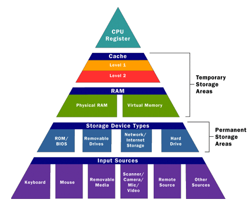
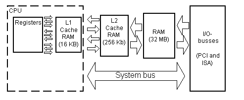
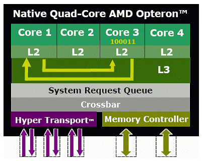
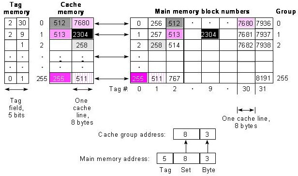
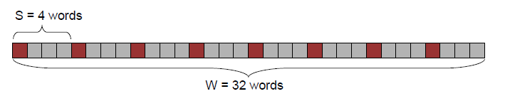
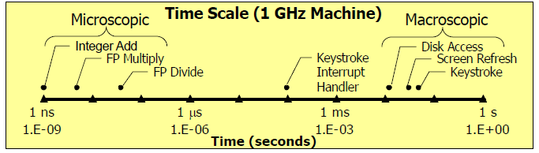
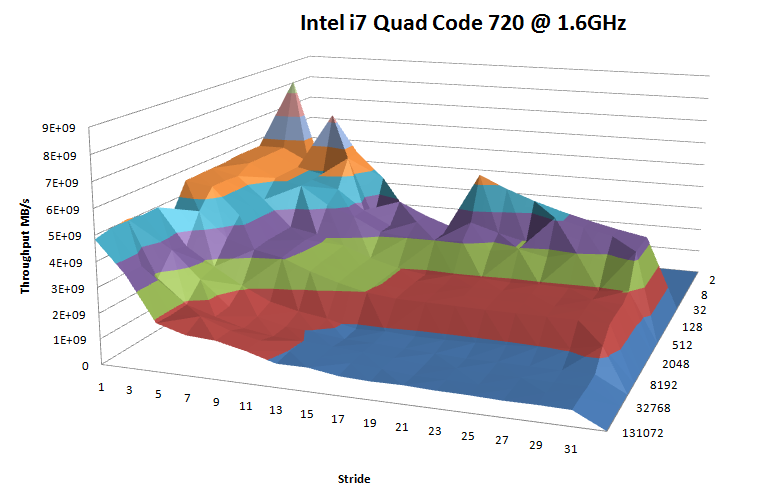

..  _lecture13:

Caching
#######

Storing bits on the variety of devices we have invented is important, but
system designers have looked more closely at how we use those devices. They
want to see if we can do better - make our machines faster

How We Use Data
***************

It should be fairly obvious that your programs work on chunks of memory for a
period of time, then move on to other chunks. Few programs deal only with
simple variables, more often we work on arrays of data, and most program code
blocks are fairly self contained - until we jump from place to place, or call
functions.

Designers of processors noticed this fact and started looking into ways to
exploit this behavior to improve the speed of processors.

Programmers can improve the performance of their programs if they work with
the processor and write programs that can benefit from processor capabilities
we will discuss in this section!

Locality of References
======================

Look at this example code:

..  code-block:: c

    int data[100], i, sum = 0;

    for(i=0;i<100;i++)
        sum += data[i];

Based on what you know about how data is organized in memory, how will the
processor be accessing memory while this code runs?

The elements of the array are stored in sequential memory locations, and the
``sum`` variable will occupy a location immediately after the array. All
elements are close together - in a block of some size!

Now try this one:

..  code-block:: c

    int data[10][10], i, j, sum = 0;

    for(int i=0;i<10,i++)
        for (j = 0;j<10;j++)
            sum += data[j][i];

This one is more subtle. How is a two dimensional array laid out in memory?  If
you remember, for C/C++ the normal method used is called ``row-major`` storage,
which means the each row is placed in successive memory locations. But how is
this code accessing the array?

In this case, the accesses are not sequential. In this simple example, the
amount of memory skipped between accesses is not that great, but it is easy to
see that the processor needs to work harder to do this sun that it would if
the programmer paid more attention.

What would happen if the array held graphics data, and each row was several
thousand bytes long?

The term ``locality`` is used in studying how memory references occur in a
typical program.  We also use the term ``stride`` when we examine how memory is
accessed:

    * Stride-1 - if memory is accessed strictly sequentially

    * Stride-N - if each memory access is N bytes away from the last

Locality of Instruction Fetches
--------------------------------

Program code exhibits the same kind of locality, except here you have less
control of how things work because you are focused on the algorithm you are
writing!

Our normal processing pattern results in strictly sequential memory references,
since instructions are laid out in sequential order in program memory.

However, branching instructions change the situation completely. Branches to a
spot nearby (like in a typical ``If-Then-Else`` statement, tend to be fairly
local. Unfortunately, calls to functions can go anywhere, this is bad from a
locality standpoint

In general, loops are a good thing! The processor will spend a fair amount of
time working on code that is fairly local. We can mess this up, of course, if
we do things like call functions in the middle of our loops!

The Memory Hierarchy
*********************

We have talked informally about the hierarchy of storage devices in an earlier lecture.
If the memory is fast, and close to the processor, it tends to be
small and expensive (relatively). As we move away, things get slower, but
larger at the same time. Ultimately, we need to balance where we put data and
code with access speed to get good performance out of our programs.

Caching in the Memory Hierarchy
===============================

The basic idea designers came up with that used locality to their advantage
was pretty simple. If you ask for something from memory, you are very likely
to ask for something nearby soon. For that reason, let's bring in a big chunk
of memory instead of a single element - if only we have a convenient place to
put it!

That place is called a cash - er cache!

Adding a cache to the picture enables us think about the memory hierarchy in a
new way. 

Ultimately, each level in the hierarchy represents a cache of elements from
the next level down in the hierarchy! Huh?

The processor is where all the action is! We want to feed it with data from
fast memory (from the cache). But we can look at other levels in the hierarchy
the same way!

Data in main memory is pulled from hard disks as it is needed for processing.

Hard disks get their data from other devices like CDs, networks, or (gasp) user
input! Clearly, that is slow!

Cache hits
==========

If we do the job right, successive memory accesses can be satisfied from the
cache - something we call a ``cache hit``. Ideally, we pick a size for the
cache that meets the most common access patterns, but it is clear that the
bigger the cache, the better for performance. Unfortunately, fast memory is
not cheap!

Cache misses
============

If a request for something in memory comes along that is not currently in the
cache, we call this a ``cache miss``, and this is a bad thing. What we do is
up to the designers!

In the simplest view, we just shrug our shoulders, and go get another chunk to
fill up the cache and press on. There are other schemes around, though! All
of these assume that the cache is actually made up of a set of blocks of data
(which may all be the same size):

    * simple replacement - kill a block and fetch a new one
    * LRU - kill the least recently used block
    * random - kill a random block

Conflict misses
---------------

Some cache management systems have subtle issues. For instance some systems
use a fixed set of cache blocks for data from certain addresses. This can
cause problems if accesses from different memory regions keep asking for the
same cache block - but that block cannot be in the cache because of the
placement strategy -causing a miss! Even though the cache may have room, there
is no way to get the two blocks into the cache at the same time!

Capacity misses
---------------

Another kind of problem can occur for simple things like array accesses where
the size of the array is bigger than the blocks available to hold the data. We
will need to invalidate the blocks over and over, even though the memory
references exhibit good locality! 

Use bigger caches, Luke!

Cache Memories
**************

Once system designers recognized the value of the cache, they added a first
level of cache between the main memory and the processor. Oddly enough, this
was called the ``L1 cache``. 

By using fast SRAM, and placing it close to the processor, this cache can be
accessed nearly as fast as the internal registers (only a 2-3 clock cycles are
needed) 

Later systems added another, slower, cache, called the ``L2 cache`` with
access speeds of around 10 clock cycles. There are even systems with a third
level (``L3 cache)`` that run at about 30-40 clock cycles. 

Here is how AMD uses the L3 cache in a multi-core system

Generic Cache Memory Organization
==================================

Cache memory is organized in a variety of ways. In a simple example, this
might be the organization:

* cache size - bytes
* Split or unified (data and instructions may be in the same cache)
* Break the cache into a set of fixed size blocks
* Associate each block with a block of memory
* add management bits to help control operation
    * valid bit marks block as holding data
    * dirty - data has been written to the cache, but not back to main memory
    * used bits track usage frequency

Direct-Mapped Caches
=====================

Here is a picture showing how the cache might be managed:

..  image:: CacheOperation.png
    :align: center

This scheme is called direct mapped since the address lines directly point to
cache blocks.

In this figure addresses from the processor are broken up into two parts. One
part (the hight part) is passed through a translation scheme that determines a
cache block number. The lower bits refer to a displacement within the selected
block. The management bits are used when a memory reference occurs. If the
cache holds the selected memory block, we have a hit, otherwise we have a
miss!

A more exotic scheme might break up the address lines into three chunks. The
middle chunk is called a ``set``, and we try to use this set to keep blocks of
memory from mapping to the same cache blocks, distributing the physical memory
into the cache more randomly. This can help in some common miss situations.

Set associative caches
=======================

There are more complex cache schemes around. In the ``set associative``
scheme, we let addresses map in such a way that multiple memory blocks map to
the same cache block, and we size the cache blocks to hold multiple memory blocks 

In this scheme, we allow two blocks per set. By tracking usage data, this
scheme can be more efficient that direct access, but it is harder to
implement.

Fully associative cache
========================

In this scheme, any block from memory can map to any location in the cache.
Finding the block for a given address is more complicated, since we must
search for it in the entire set!

Cache writes
=============

When we are done with the data in a cache, either because the program is about
to end, or because we need to use the cache block for other purposes, we need
to deal with the issue of writing the cache contents back to main memory!
There are several issues to deal with here:

* Normal ``write hit`` writing:
    * use ``Write-through`` to cache and main memory simultaneously
        * This may not be fast, but it is safe!
    * Use ``Write-back`` write to cache but wait to write to memory
        * The delay can cause problems

* ``Write miss`` writing        
    * ``Write allocate`` - load block into cache and write
    * ``No-write allocate`` - skip loading and write directly to memory

Writing Cache-Friendly Code
***************************

Now that you know something about how caches work, how does this impact how
you write your code? Here are some things you should do:

Identify where your code spends it's time
=========================================

There are a variety of profiling tools available to use on your program. They
will give you a time map showing where your program spends its time for a
typical run. These can help you identify problem areas that might need
attention.

* ``gprof.exe`` - MinGW profiling tool

Optimize references in the long places
--------------------------------------

Once you identify those parts of your program that consume the processor,
examine the code in that area looking for common problems.

* Minimize misses in loops
* Avoid incorrect array referencing
* declare data using locality of reference

If all else fails, consider rewriting those routines in assembler (yikes) to
get better performance, or add threading and other tricks!

The Impact of Caches on Program Performance
*******************************************

Let's look at a program that can show you the impact of caches on program
performance. Note that this code is from CMU and is a bit old. I had to fight
with it to get it running under MinGW and my Quad-code pentium is not the best
machine for these tests (I have not had time to research the details of the
cache on this system!)

Approach
========

* Write a program that performs memory accesses with different locality patterns

* Allocate array of "W" words

* Loop over the array with stride index os "S" and measure access speed

* Vary W and S and plot cache characteristics

What happens as you vary W and S?

* Changing W varies the total amount of memory accessed by the program.  
  
  * As W gets larger than one level of the cache, performance of the program
    will drop.

* Changing S varies the spatial locality of each access.

    * If S is less than the size of a cache line, sequential accesses will be
      fast.

    * If S is greater than the size of a cache line, sequential accesses will
      be slower.

Timing with more accuracy
=========================

The processor runs at a fixed speed - determined by the crystal controlled
clock installed on the system motherboard. For my quad-core laptop, the system
info page tells me this about my system (using the Windows 7 Performance
Information panel found in the Control Panel):

..  csv-table::
    :header:  Component, What is rated, Subscore

    Processor:,Intel(R) Core(TM) i7 CPU Q 720 @ 1.60GHz, calculations per second, 6.2
    memory (RAM), Memory Operations per second, 7.3
    Graphics, Performance for Aero, 6.4
    Gaming graphics, 3D and business gaming performance, 6.4
    Primary hard disk, disk transfer rate, 5.9

Which give a total performance index of 5.9 limited by the slow hard disks in
my system

Here is an interesting figure showing the relative speeds of various devices
in our systems:

Processor support for timing
----------------------------

The processor has a special instruction, ``RDTSC`` that returns the current
value of the system clock as an integer number (big number). This gives us a
way to measure time of as little as one instruction!

As you can see, all the times are reasonable close, so any of these techniques
can be used. Also, the published speed of my clock is pretty close the
value produced by this code. Seems the Intel likes to overstate the speed a
bit (or HP under clocked the processor to improve battery performance!)

The ``RSTSC`` instruction returns a 64 bit value, the high 32 bite end up in
the ``%edx`` register, and the low 32 bits in the ``%eax`` register. If you
work out the numbers, this 64 bit counter will wrap around in a short time -
about 300 years!
    
The two Windows system routines we can call that access this counter are:

..  code-block:: c

    #include <windows.h>
    
    LARGE_INTEGER frequency, counter;

    QueryPerformanceFrequency( & frequency)
    QueryPerformanceCounter( & counter)

Where the ``LARGE_INTEGER`` data type is defined as follows:

..  code-block:: c

    typedef union _LARGE_INTEGER {
        struct {
            DWORD LowPart;
            LONG HighPart;
        };
        struct {
            DWORD LowPart;
            LONG HighPart;
        } u;
        LONGLONG QuadPart;
    } LARGE_INTEGER, * PLARGE_INTEGER;

This gives us multiple ways to refer to the ``large integer`` data container.
We will use the first one (``Lowpart`` and ``HighPart``).  Here is a short
program you can use to check out your system clock:

..  code-block:: c

    #include <windows.h>
    #include <stdio.h>

    int main(void) {

        LARGE_INTEGER frequency, counter;
        long grequency;

        printf("sizeof LARGE_INTEGER = %d\n", sizeof(LARGE_INTEGER));
        printf("size of frequency = %d:%d\n", sizeof(frequency.HighPart),
            sizeof(frequency.LowPart));
        QueryPerformanceFrequency( & counter);
        printf("Frequency = %d %d\n", frequency.HighPart, frequency.LowPart);
        printf("Frequency (double) = %ld\n", (long)frequency.QuadPart);
        printf("frequency (long) = %ld\n", (long) frequency.QuadPart);
    }   

Which gave this on my system:

..  code-block:: bash

    sizeof LARGE_INTEGER = 8
    size of frequency = 4:4
    Large Frequency = 0:1558847
    Frequency (double) = 1.55885e+006
    Frequency (long) = 1558847

Another example of timing tests
--------------------------------

Here is a program I found that uses a variety of techniques to measure code
much the same way as our earlier code analysis program did, only much more
accurately!

..  code-block:: c

    #include <sys/time.h>
    #include <sys/timeb.h>
    #include <stdio.h>
    #include <stdlib.h>
    #include <windows.h>

    int main (int argc, char * argv[]) {
        int count = atoi(argv[1]);
        FILETIME ft_before, ft_after;
        struct _timeb tb_before, tb_after;
        struct timeval tv_before, tv_after;
        LARGE_INTEGER pcfreq;
        LARGE_INTEGER pc_before, pc_after;
        int i, j;
    
        QueryPerformanceFrequency (&pcfreq))
            printf ("QueryPerformanceFrequency failed\n");
    
        GetSystemTimeAsFileTime (&ft_before);
        _ftime (&tb_before);
        gettimeofday (&tv_before, NULL);
        if (!QueryPerformanceCounter (&pc_before))
        printf ("QueryPerformanceCounter failed\n");
    
        for (i = 0; i < count; i++)
            for (j = 0; j < 1000000; j++)
                ;
    
        GetSystemTimeAsFileTime (&ft_after);
        _ftime (&tb_after);
        gettimeofday (&tv_after, NULL);
        if (!QueryPerformanceCounter (&pc_after))
        printf ("QueryPerformanceCounter failed\n");
    
        printf ("GetSystemTimeAsFileTime %ld * 0.1us\n"
              "_ftime %ld ms\n"
              "gettimeofday %ld us\n"
              "QueryPerformanceCounter %ld (freq %ld) = %g s\n",
              (ft_after.dwHighDateTime - ft_before.dwHighDateTime) * 0x10000 
                    + ft_after.dwLowDateTime - ft_before.dwLowDateTime,
              (tb_after.time - tb_before.time) * 1000 
                    + tb_after.millitm - tb_before.millitm,
              (tv_after.tv_sec - tv_before.tv_sec) * 1000000 
                    + tv_after.tv_usec - tv_before.tv_usec,
              (long) (pc_after.QuadPart - pc_before.QuadPart), 
              (long) pcfreq.QuadPart, 
              (double)(pc_after.QuadPart - pc_before.QuadPart) / (double) pcfreq.QuadPart);
        return 0;
    } 

This program uses several ways to get system time. The most accurate uses the
``QueryPerformanceCounter`` function, which is the one we really want to use.
The code being timed is the empty two stage ``for loop``.

Here is what mu quad-core laptop produced:

..  code-block:: bash

    c:\>TimerTest 1000

    GetSystemTimeAsFileTime 29801704 * 0.1us
    _ftime 2978 ms
    gettimeofday 2978170 us
    QueryPerformanceCounter 4642295 (freq 1558847) = 2.97803 s

We can use these Windows functions to use the code shown in the textbook to do
some cache performance testing.

The Memory Mountain code
========================

The code in the textbook seeks to test cache performance using the simple
scheme described earlier. I changed this code to eliminate the Linux timing
routines, replacing them with those suitable for Windows. This part compiles
fine with MinGW

Here is the main cache performance test routine:

..  code-block:: c

    #include <sys/time.h>
    #include <sys/timeb.h>
    #include <stdlib.h>
    #include <stdio.h>
    #include "fcyc2.h" 
    #include <windows.h>
    
    #define MINBYTES (1 << 10) 
    #define MAXBYTES (1 << 27)
    #define MAXSTRIDE 32
    #define STRIDESTRIDE 2
    #define MAXELEMS MAXBYTES/sizeof(int) 
    
    int data[MAXELEMS];
    
    void init_data(int * data, int n);
    void test(int elems, int stride);
    double run(int size, int stride, double Mhz);
    double getClockFrequency();
    
    double getClockFrequency() {
        LARGE_INTEGER pcfreq;
    
        if(!OueryPerformanceFrequency(&pcfreq))
            printf ("QueryPerformanceFrequency failed\n");
        return (double) pcfreq.QuadPart;
    }
    

    int main() {
        int size; 
        int stride;
        double Mhz;
    
        init_data(data, MAXELEMS);
        Mhz = getClockFrequency();
    
        printf("Clock frequency is approx. %.1f MHz\n", Mhz);
        printf("Memory mountain (MB/sec)\n");
    
        printf("\t");
        for (stride = 1; stride <= MAXSTRIDE; stride += STRIDESTRIDE)
	    printf("s%d\t", stride);
        printf("\n");
    
        for (size = MAXBYTES; size >= MINBYTES; size >>= 1) {
	        if (size > (1 << 20))
	            printf("%dm\t", size / (1 << 20));
	        else
	            printf("%dk\t", size / 1024);
    
	        for (stride = 1; stride <= MAXSTRIDE; stride += STRIDESTRIDE) {
	            printf("%.0f\t", run(size, stride, Mhz));
	        }
	        printf("\n");
        }
        exit(0);
    }
    
The actual test loop doubles the size of the test array on each pass, then
runs an inner loop that adjusts the stride value a number of times. The data
produced should be something we can plot (using Excel)! 

Here is the code to initialize the data array:

..  code-block:: c

    void init_data(int * data, int n) {
        int i;
    
        for (i = 0; i < n; i++)
    	    data[i] = 1;
    }

And the main test routine. This one simple sums up the elements in the array,
but does so using the stride value we set in the main loop:

..  code-block:: c

    void test(int elems, int stride) {
        int i, result = 0; 
        volatile int sink; 
    
        for (i = 0; i < elems; i += stride)
	        result += data[i];
        sink = result; 
    }

Finally, we run this test using code that calls timer functions to see what is
happening. We hand this routine the frequency of the system to assist in the
calculations.

..  code-block:: c

    double run(int size, int stride, double Mhz) {
        double cycles;
        int elems = size / sizeof(int); 
    
        test(elems, stride);
        cycles = fcyc2(test, elems, stride, 0); 
        return (size / stride) / (cycles / Mhz); 
    }

The timing routines are in this next file (``fcyc2.c``). These routines call
functions available in the Linux world that we will replace .

The missing routines are shown here:

..  code-block:: c

    void start_comp_counter();
    double get_comp_counter();
    void start_counter();
    double get_counter();

There are some subtle things going on in these routines. For one thing, just
running test like this (as we did earlier) will not be accurate due to other
things going on while the test runs. Remember the discussion we had about
Windows ripping the processor away from your program so others can run. These
``context switched`` all incur some overhead in your program, since some time
given to your code is actually being used to save your state before the
switch. These switches also affect the cache since the other programs use the
same caches, so your program will not have dedicated access to that resource!
Durn, this is hard to do right! Oh, well, we do the best we can!

At the least, we can only measure the total time spent in our program, and not
worry about time spent in context switching.

When to switches occur?
-----------------------

A system context switch is driven by a system interrupt that generates an
interrupt every so many clock ticks, typically about every 10ms. This
interrupt is also used to update the system time of day clock, so one way to
see if we have been interrupted is to check the time of day and see if it has
changed!

..  code-block:: c

    start = get_etime();

    // do measurement

    if (get_etime() - start > 0)
        // discard measurement

The ``get_etime()`` routine queries a counter incremented each time the
interrupt occurs. We can use this scheme to improve our measurements, but we
cannot ever get rid of interference from other things going on in our system.
As a result, the data we produce are  always subject to variations if we run
the test multiple times.

I have not had time to work up these routines, so the data we produce will not
be as good as possible!

The timer routines
------------------

Her is the timer code:

..  code-block:: c

    // Compute time used by a function f that takes two integer args
    #include <stdlib.h>
    #include <stdio.h>
    #include "fcyc2.h"
    #include <windows.h>

    // MinGW additions - these are not complete, compensation does not work

    double init_count;

    void start_comp_counter() {}; // not used yet
    double get_comp_counter() {
        return 0;
    }

    void start_counter() {
        LARGE_INTEGER pccount;
        QueryPerformanceCounter( & pccount);
        init_count = (double) pccount.QuadPart; 
    }

    double get_counter() {
        LARGE_INTEGER pccount;
        QueryPerformanceCounter( & pccount);
        return (double) pccount.QuadPart - init_count;
    }
   
    static double * values = NULL;
    int samplecount = 0;
    
    #define KEEP_VALS 1
    #define KEEP_SAMPLES 1
    
    #if KEEP_SAMPLES
    double * samples = NULL;
    #endif
    
    // Start new sampling process
    static void init_sampler(int k, int maxsamples) {
        if (values)
            free(values);
        values = calloc(k, sizeof(double));
    #if KEEP_SAMPLES
        if (samples)
            free(samples);
        // Allocate extra for wraparound analysis
        samples = calloc(maxsamples+k, sizeof(double));
    #endif
        samplecount = 0;
    }
    
    // Add new sample. 
    void add_sample(double val, int k) {
        int pos = 0;
        if (samplecount < k) {
            pos = samplecount;
            values[pos] = val;
        } else if (val < values[k-1]) {
            pos = k-1;
            values[pos] = val;
        }
    #if KEEP_SAMPLES
        samples[samplecount] = val;
    #endif
        samplecount++;
        // Insertion sort
        while (pos > 0 && values[pos-1] > values[pos]) {
            double temp = values[pos-1];
            values[pos-1] = values[pos];
            values[pos] = temp;
            pos--;
        }
    }
    
    // Get current minimum
    double get_min() {
        return values[0];
    }
    
    // What is relative error for kth smallest sample
    double err(int k) {
        if (samplecount < k)
            return 1000.0;
        return (values[k-1] - values[0])/values[0];
    }
    
    // Have k minimum measurements converged within epsilon?
    int has_converged(int k_arg, double epsilon_arg, int maxsamples) {
        if ((samplecount >= k_arg) &&
            ((1 + epsilon_arg)*values[0] >= values[k_arg-1]))
            return samplecount;
        if ((samplecount >= maxsamples))
            return -1;
        return 0;
    }
    
    // Code to clear cache
    #define ASIZE (1 << 17)
    // Cache block size is 32 bytes
    #define STRIDE 8
    static int stuff[ASIZE];
    static int sink;
    
    static void clear() {
        int x = sink;
        int i;
        for (i = 0; i < ASIZE; i += STRIDE)
            x += stuff[i];
        sink = x;
    }
    
    double fcyc2_full(test_funct f, int param1, int param2, int clear_cache,
    		 int k, double epsilon, int maxsamples, int compensate) {
        double result;
        init_sampler(k, maxsamples);
        if (compensate) {
            do {
                double cyc;
                if (clear_cache)
    	            clear();
                f(param1, param2);   // warm cache
                start_comp_counter();
                f(param1, param2);
                cyc = get_comp_counter();
                add_sample(cyc, k);
            } while (!has_converged(k, epsilon, maxsamples) 
                    && samplecount < maxsamples);
        } else {
        do {
            double cyc;
            if (clear_cache)
    	        clear();
            f(param1, param2); // warm cache
            start_counter();
            f(param1, param2);
            cyc = get_counter();
            add_sample(cyc, k);
        } while (!has_converged(k, epsilon, maxsamples) 
                && samplecount < maxsamples);
        }
    #ifdef DEBUG
        {
            int i;
            printf(" %d smallest values: [", k);
            for (i = 0; i < k; i++)
                printf("%.0f%s", values[i], i==k-1 ? "]\n" : ", ");
        }
    #endif
        result = values[0];
    #if !KEEP_VALS
        free(values); 
        values = NULL;
    #endif
        return result;  
    }
    
    double fcyc2(test_funct f, int param1, int param2, int clear_cache) {
        return fcyc2_full(f, param1, param2, clear_cache, 3, 0.01, 300, 0);
    }
    

This code compiles and runs on my system, but I have not had time to produce a
graph of the results. Here is what I saw:

..  code-block:: bash

    Clock frequency is approx. 1558847.0 MHz
    Memory mountain (MB/sec)
            s1      s3      s5      s7      s9      s11     s13     s15     s17
    s19     s21     s23     s25     s27     s29     s31
    128m    4826967416      2895405537      1976336825      1549951856      12739593
    39      972365661       942395030       801904450       722134981       67928169
    2       625625746       597879348       587421627       570539609       55647134
    7       543456817
    64m     4919234991      3066375008      1977924846      1528237551      12929482
    77      1081690352      932025847       798873197       698645917       67342438
    3       642614165       610846947       592285517       563322839       55031651
    0       559912909
    32m     4793898420      3333092624      1884908920      1516605948      12993075
    13      1113608901      923045556       818755929       681168169       65970718
    8       620057880       609210603       588371369       581238063       58276651
    5       549071771
    16m     4963581862      3432166833      2306270835      1592565538      12926606
    99      1077767454      957533456       730431819       692981221       66176877
    3       649992824       593162019       577330858       572140125       58981713
    7       588317989
    8m      5041078032      3060990940      2233399101      1672406980      14705970
    11      1251343918      1085100448      849677969       821803820       80307904
    9       774492968       753040789       830256758       982386644       10761699
    31      1274392744
    4m      5508237749      5354853930      4231891244      3265871673      30524123
    70      2618450930      2255351024      1981294537      1857987480      18304180
    48      1820733296      1810655400      1604483920      1780570062      17752566
    97      1772369740
    2m      5531538247      5368039386      4301494718      3335854638      31313473
    50      2677425050      2286105811      2017985177      1885303184      18702097
    44      1875574660      1845917785      1841766753      1834526730      18480003
    41      1850105255
    1024k   4779443134      4697034463      3714927257      2882827719      27517900
    95      2396727263      2095584003      1846969484      1716958624      16868558
    48      1729696631      1692091303      1676479993      1681649503      16577420
    88      1700903219
    512k    4779443134      4697021024      2636387417      2918863065      27517900
    95      2476592190      2095558022      1878786908      1716958624      17205929
    65      1769007918      1316071014      1720556865      1681649503      17613022
    54      1883087176
    256k    4807557506      4864771775      4086361526      4169804379      23897124
    51      3095740238      2857508264      2476582743      2670824527      26884265
    07      2432385888      2538025608      2724085133      1681649503      28180836
    07      1647701279
    128k    4864790333      4864716102      4540401695      4169693033      37835814
    77      2653380286      1964536932      2724241017      2403742074      26882316
    52      2432191032      2960770069      2723825325      2522214446      10063470
    85      941543588
    64k     4864790333      4864716102      1702650636      1621547290      14187456
    26      1857210316      873127525       972943220       858479312       67205791
    3       694800377       1480385034      817147597       945830417       88035884
    3       1098467519
    32k     5675588722      1891747437      1702520732      3648481404      28371015
    40      2321123183      1964147220      1702260924      3003898169      1
    1       2219798128      2042089570      1890881411      1759938263      16477012
    79
    16k     1964626865      2128215867      1702260924      3647701980      28371015
    40      1160561592      1964147220      1702260924      1501169661      1
    1215900660      1       1       1       1       1
    8k      1824296375      2127826155      2553391386      1823850990      14185507
    70      1159782168      982073610       1       749805407       1       1
    1       509742969       1       1       1
    4k      2128345771      2127826155      1       1       1       1       1
    1       1       1       1       1       1       1       1       1
    2k      1596259328      1       1       455183324       1       1       1
    1       1       1       1       1       1       1       1       1
    1k      1       1       1       1       1       1       1       1       1
    1       1       1       1       1       1       1

Interesting pile of data just waiting for an eager student to analyze. You get
to do that for today's lab project!

Here is what it looked like when plotted by Excel:

To get this plot, I altered the output routine a bit so it generated a simple
``comma-separated`` data file that Excel can read in. You need to tweak the
legends a bit to get something similar.

This analysis did not take into consideration any information abou the actual
caches in the i7. A little research on the `Intel web site <www.inten.com>`_
turned up this information about the cache system in my chip:

* 32KB data cache (L1) per core (8-way, 64 byte line size,
  2 thread sharing)
* 32KB instruction cache (L1) per core (4-way, 64 byte line size, 2 thread
  sharing)
* 256KB shared instruction/data cache (L2) per core (8-way, 64 byte line size, 2 thread
  sharing)
* 6MB L3 cache shared among all cores (12-way, 64 byte line size, 8 thread
  sharing)

None of the example plots from this program I could find on the Internet showed
quad-core performance, so the details of this chart need study.

The missing header file
=======================

Finally, this is the header file for the timer functions:

..  code-block:: c
    
    // Find number of cycles used by function that takes 2 arguments
    
    // Function to be tested takes two integer arguments
    typedef void (* test_funct)(int, int); 
    
    // Compute time used by function f
    double fcyc2(test_funct f, int param1, int param2, int clear_cache);
    
    // These routines are used to help with the analysis
    
    //
    // Parameters:
    //   k:  How many samples must be within epsilon for convergence 
    //   epsilon: What is tolerance 
    //   maxsamples: How many samples until give up?
    //
    
    // Full version of fcyc with control over parameters
    double fcyc2_full(test_funct f, int param1, int param2, int clear_cache,
		    int k, double epsilon, int maxsamples, int compensate);
    
    // Get current minimum
    double get_min();
    
    // What is convergence status for k minimum measurements within epsilon
    //   Returns 0 if not converged, #samples if converged, and -1 if can't
    //   reach convergence
    //
    
    int has_converged(int k, double epsilon, int maxsamples);
    
    // What is error of current measurement
    double err(int k);
    
    //  Try other clocking methods
    
    // Full version that uses the time of day clock
    double fcyc2_full_tod(test_funct f, int param1, int param2, int clear_cache,
		        int k, double epsilon, int maxsamples, int compensate);
    
    double fcyc2_tod(test_funct f, int param1, int param2, int clear_cache);

..  vim:filetype=rst spell
