..  _storage-technologies:

Storage Technologies
####################

We have focused on how bits move around inside the processor. We also need to
look at where those bits can come from. We know there is this component called
"memory" out these somewhere, but where else can the bits come from?

Over time, we have developed a number of interesting places to store "bits". Let's review the istory of these bit storing gadgets.

How do we store any data?
*************************

iFiguring out how to store data is an interesting problem. One of the earliest
idea for storing bits was a simple hole in a chunk of wood. The Jacquard Loom
was one of the first devices to use such a scheme to control the operation of a
weaving machine

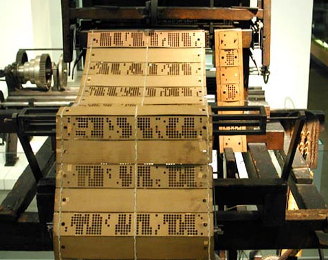

This evolved into the Hollerith punched card that I used to write programs when
I first learned about computers in the late 1960's:

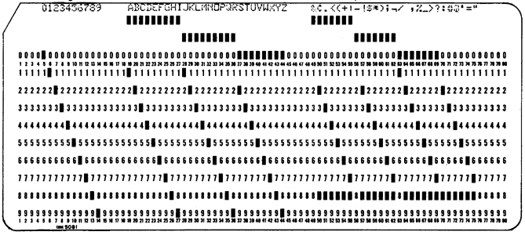

As technology marched on, we figured out how to use magnetism to store bits.
The first memory devices based on this was called "core memory":

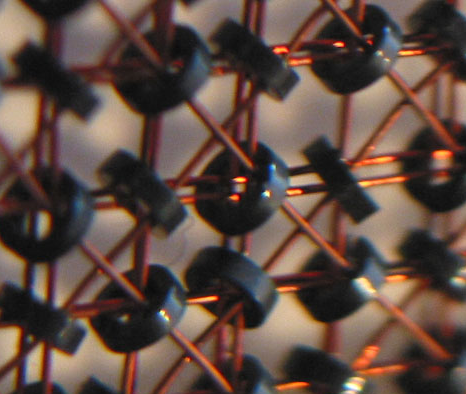

This was pretty clumsy to build and the density was bad, so we moved on to drum
memory:

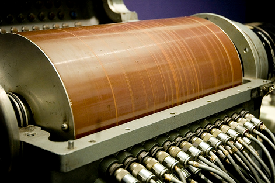

Finally, we moved to rotating disks that looked like this:

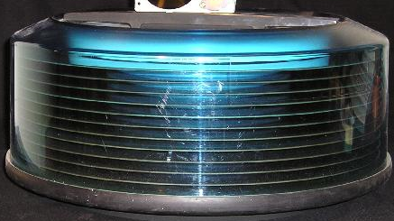

Internally, we moved to solid state memory devices with the introduction of
the transistor, and later the integrated circuit:

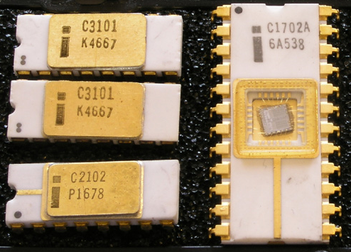

And eventually, we ended up with these kinds of cards:

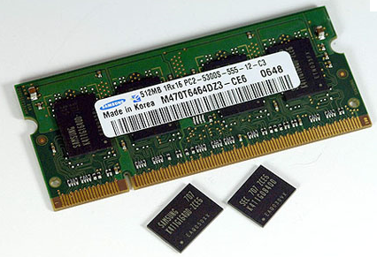

It has been quite a ride! And this review only touches part of the spectrum of
storage devises folks have developed (what did we miss> You should be able to
come up with a dozen more!)

Random-Access Memory
=====================

We have discussed the general hierarchy of storage locations in an earlier
lecture, and you know that the further you are from the internals of the
processor, the more time it takes to get at out data and instructions. The most
important kinds of memory devices in our systems are what we call "main
memory", which is the kind of memory you want to add as much of as possible.

This memory is addressable using a set of address lines that are connected to
the device. The contents of the memory may be accessed by one or more data
lines, and the access is controlled by (you guessed it) control lines.

Memory devices come in all shapes and sizes. Some store single bits, others
more than one bit. Generally, manufacturers today combine a munber of devices
to build a general memory module like we saw earlier.

Today, memory devices come in two basic technologies:

Static Ram
----------

The first kind of memory chip developed was a device that was constructed of
electronic circuits called "flip-flops". These devices could be set into one
of two different states using a control line and would stay in that state
until something caused the state to change. This kind of device is called
``bi-stable`` and is quite common in the electronics world!

Such devices are pretty complex, and expensive to produce, so they are not
used for most of the  memory in a system. However, they are fast, and used in
places like cache memory devices.

Dynamic Ram
-----------

Another technology surfaced in an attempt to simplify the memory chip, and
lower the cost of production. The "dynamic memory" device is based on a set of
simple capacitors, one per bit. These capacitors can be charged or discharged
as needed to record the state of the selected bit

Left alone, a charge in a capacitor will leak out, and these memory devices
have a special refresh line that essentially recharges those capacitors that
currently have a charge. Reading and writing these chips involves selecting
the address of the capacitor and either charging, or discharging the
capacitor. Simple idea, and it has worked very well!

Memory Modules
---------------

Dynamic ram chips are typically constructed in a rectangular array of cells,
some number of rows and columns. Once again, a number of these chips will
typically be installed in a memory module to plug into a computer. These
modules can deliver data in 64 bit chunks, and more are possible. 

Inside the computer, a special memory controller helps keep the refresh and
access timing needs of the memory in order.

DRAM chips are very inexpensive, and today comprise the vast majority of
memory devices installed in computer systems. How much do you have (or how
much can you afford?)

There are a number of different DRAM technologies available, and more are
being developed all the time. Each of these modules tries to balance the needs
of the latest processors, with the cost issues so we can get the systems we
want to meet our needs. 

Non-Volatile RAM
================

Both the static and dynamic ram chips we have discussed suffer from one
serious flaw - they get forgetful if the power goes away. This is a big
problem. We need some kind of memory that can hold the program the processor
will run when it first powers up, one that does not forget its contents when
no power is available. 

Read Only Memory (ROM)
----------------------

The earliest versions of such memory chips were called
"read-only memory" since they were programmed at manufacture time and the
contents could never be changed. These were useful once a program was
debugged, but it was a pain to use during development. 

Programmable-Read-only memory (PROM)
------------------------------------

It became obvious that designers needed a way to build systems and put their
own code into the ROM chips, so devices that could be field-programmed (once)
were developed. These were called "Programable Read-Only Memories.

Erasable ROM Memories
---------------------

A later development added a quartz crystal window into the internals of the
chip. When an ultraviolet light was shine dinto the window for long enough, the
state of the internal bit stores could be erased, then reprogrammed. It was
painful, but effective. And now system designers could debug their systems and
system softweare in a more reasonable way.

Flash Memories
--------------

The latest development in these memory devises is the "flash memory chip"
which can be programmed by a fairly simple electronic system. These devices
have taken over the consumer market - giving us the digital camera market as
an example. Not to mention MP3 players.

The data pathway
================

Once we add memory to our systems, we need to add a set of lines over which
the bits can travel to and from the processor. The lines are called ``buses``
and are usually as wide as possible to move more information in one operation.

The timing of access to the bus allows for more than one device to use the bus
as needed. The processor will perform a read or write and then go into an
internal processing state where the bus is unused. During these times, other
devices in the system can more data over the buses. One common use of this
tactic is to let the disk controller move data from the disk to main memory in
the background, while the processor is not using the bus. Once the transfer is
complete, the processor will be signaled by the disk controller that the data
is available. The graphics card can do similar tricks to move blocks of memory
from the main memory to the graphics memory for its internal crunching needs.

There are a number of devices on a typical system motherboard that handle
these transfers. In the PC we have two devices, called the ``northbridge`` for
hihg speed transfers between the processor and main memory or the graphics
system, and the ``southbridge`` for slower transfers (like to
and from external devices like disks). Here is a diagram that shows the
various devices and data paths available:

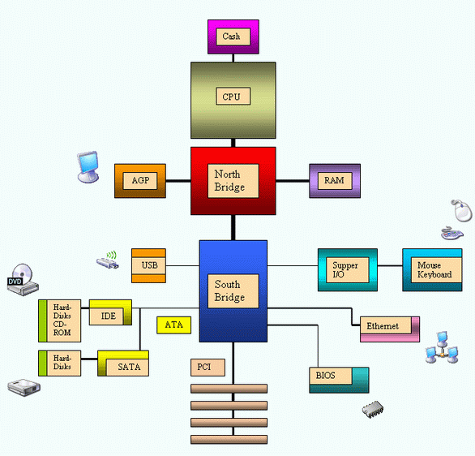

Disk Storage
************

We can never have enough main memory to suit our computing needs. And, once
the power goes away, we need a place to store our programs and data so we can
compute another day. Modern disk drives use the rotating platter technology we
saw earlier. Such devices have become huge - holding terabytes of data and
spinning at high speeds so we can get at our data!

Disk Geometry
=============

A modern hard disk is a physical device with a number of platters each side of
which has magnetic media available for reading and writing. The platter is
arranges as a series of concentric tracks each divided up into a number of
sectors per track. Each sector can hold a fixed number of bytes. It looks
something like this:

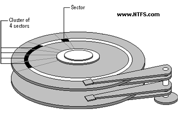

Disk manufacturers continually seek ways to increase the density of nit
storage on these devices. They work on technoligies that increase the number
of bits per inch that can be recorded, and seek ways to decrease the distance
between tracks. It is pretty amazing to note that they can build disk drives
as tiny as this:

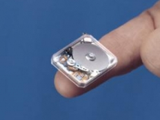

Obviously, most are larger, but it is amazing to see how they build these
things!

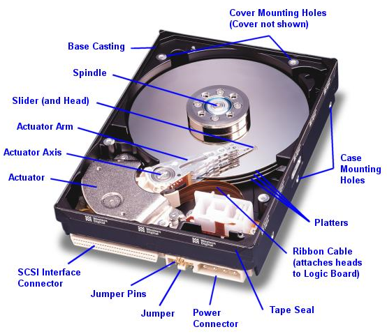

Disk Capacity
============= 

The capacity of a disk drive is a function of the number of platters, the
number of tracks, and the bit density of each track.  The higher capacity
drives pack a lot of platters and space the tracks very closely - these are
precise devices. We can come up with a simple formula to calculate capacity as
follows:

Most sectors hold 512 bytes of data, so, the formula we need is:

    * capacity = platters * 2 * tracks * sectors * sector_size

Logical Disk Blocks
===================

A ``cluster`` is a grouping of usually 8 sectors. The physical disk has
management data stored in the spaces between sectors to help the hardware
access the data areas. Most of the time, we do not worry about all of this.

In fact, many manufacturers hide the physical layout of the disk using
processing hardware like we will explore later in the course
(microcontrollers), and present a logical layout that can be expressed with a
simple number of sectors. This is called Logical Block Access (LBA). Modern
Bios software knows about all of this.

Disk Operation
==============

Disk drives are managed by disk controllers, usually located on the
motherboards. Increasingly, they are also supported by intelligence on the
drives themselves! The processor (actually, the operating system) sends
commands to the controller to start the drive spinning (it might be powered
down to save energy or batteries), and to seek to a specific track and sector.
The drive will them be commanded to either read or write as needed to a number
of sectors. The time delay before we can read or write is called the dick
``access time``.

Most modern drives have buffers on-board where data destined for writing, or
where data from the drive can be staged for reading by the drive itself. Then
the commands will simple move data to and from these buffers using the
background bus transfers we mentioned earlier.

Disk drives are rotating machines. So, among the considerations we need to
deal with is how fast we can reach any given sector on the disk. This is a
combination of rotational speed, and the speed of movement of the read/write
haeds as they move from track to track. Obviously, accessing sectors
sequentially on a single track is a good thing to do, as is accessing tracks
that are close together.

However, we depend on the operating system to lay out where our data and
programs will live, and you all know that things can get out of control if we
are not careful. Defragmenting a disk is an operation that seeks to maximize
access speed by reorganizing data more efficiently.

If we cannot read the data we need fast enough, we might need to wait for the
drive to spin around another time, or wait while we reposition the read/write
heads to access the next sector we need. All of these delays impact the speed
of data transfer. Fortunately, as normal programmers, we have little control
over these things - unless you are writing an operating system!

Originally, the commands sent to a disk included details about where a sector
was located - including the platter number, side, track number and sector
number. The Logical Data Block idea removed that complexity and replaced it
with a simple integer number we wish to access. The on-board drive electronics
takes care of figuring out where that block is located. 

Solid State Disks
*****************

Recent developments in drive technologies are producing disk devices with no
moving parts. We have been moving in this direction as flash drive capacities
increase. The advantage of such devices in portable applications and in
reliability should be obvious. With no moving parts to wear out, or to be
damages by shocks to the device, we get a more stable device. Unfortunately,
the speed of these devices is not that great, nor is the capacity that high.
But improvements are being made all the time, and we now see commercial
devices with solid state drives on the market.

Storage Technology Trends
*************************

System designers are always seeking more ways to store data. There are
advances yet to hit the market, but which are working in the labs. The one I
like is "holographic memory" which works like the image on your credit card. 

Basically, we send a laser beam toward the image recording surface from a
number of different directions all at once. Each individual light beam can
record a single bit, seemingly on exactly the same spot. This has the
potential to dramatically increase storage, and who knows where this will
lead. Here is a basic holographic storage setup:

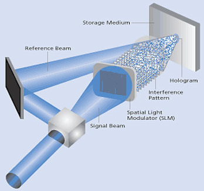

We have hit a kind of wall in developing systems. We can not get processors to
go much faster and we are reaching the end of capacity enhancing schemes. SO,
the next generation systems will probably be constructed out of larger
quantities of the standard parts we use today. We see this trend in the
multi-core chips coming out now, and in the increase in the number of DRAM
slots in modern systems. Even so, it is fun to see where technology will take
us. I never thought I could own a machine as powerful as the Cray-2 I ran for
the USAF a mere 17 years ago. That $8,000,000 machine can now be replaced by a
$5000 desktop. And that system had 1.2 terabytes of data storage then, I have
that much on my desktop today!

