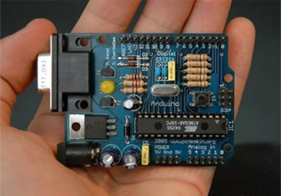
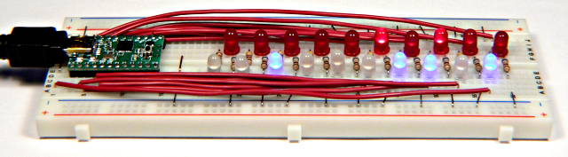
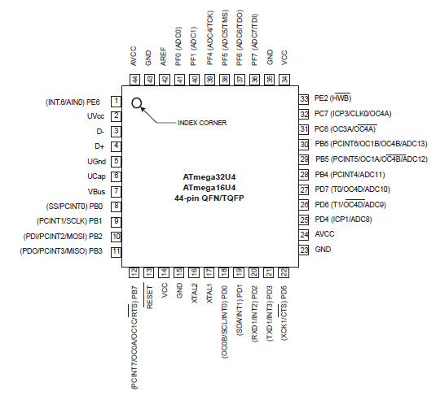
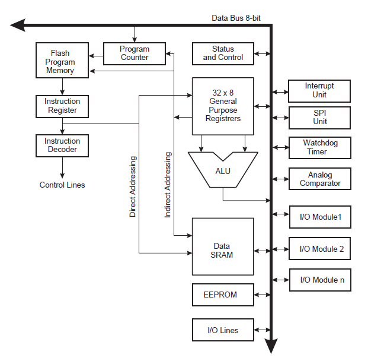
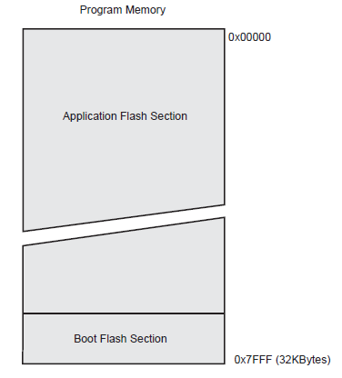
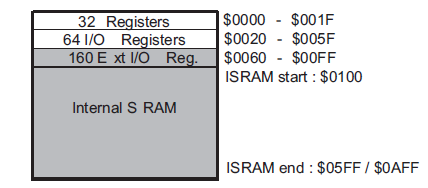
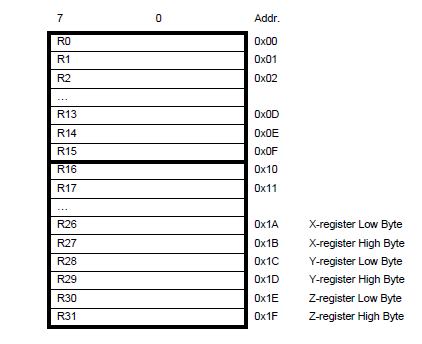

..  _arduino-intro:

Embedded Machines
#################

..  include::   /references.inc

We are ready to leave the world of Pentium programming and explore another
architecture, this one common to much smaller and simpler computing devices.
Specifically, we will explore a `microcontroller`.

Using this system, we will explore aspects of assembly language programming
that is too hard to do on the Pentium!

What is a Microcontroller?
**************************

* Basically, a ``microcontroller`` is a special purpose computer
    * with many special features you might not expect
* They are designed to be buried inside equipment
    * Low cost and flexible - makes them popular
* They find application in robotics, control systems, system boards
    * Your PC may have several, your car has dozens!

Typical microcontrollers
************************

* Major vendors include Microchip_ and Atmel_

* Popular microcontrollers
    * PIC family from Microchip_
    * AVR family from Atmel_
    * ARM used in many hand-help devices (including cell phones)
    * We will be using the Teensy2_ and/or Arduino_ boards based on the Atmel_ AVR chip family

The Atmel_ AVR microcontroller
******************************

This chip has become hugely popular because of this $35 board:

* There are thousands of these in the hands of experimenters
    * Many knew nothing about programming when they started!

Our class system
****************

I have purchased enough of these Arduino boards to use in our lab projects. You
will need to share the board with another student, but your software
development will happen on your own machine. You will only need access to a
physical board when you are ready to load your program on the actual board.

Typical project setup
*********************

Most of my Arduino boards are mounted on a board that also contains a simple
breadboard we can use to wire up a simple circuit controlled by the Arduino_.
For the lab projects, you will not be creating anything very complicated, we
will control an LED and a buzzer for most of our lab projects.  Here is a
breadboard wired up with another smalled AVR board, the Teensy2_ board I have
used in previous classes.

* The breadboard allows components to be hooked up for experiments
    * We will use LED lights, buzzers, servos, and other fun things!

Programming the Arduino
***********************

* Arduino_ development tools are available for all three major platforms.   
    * The board is powered by a USB cable 
    * Code is downloaded from PC to the Arduino_ over this USB cable. 
    * Obviously, we will use assembly language!  
    * We will use tools based on the Gnu_ compilers we have been using 
    * There are "C" language tools for most microcontrollers

The Arduino_ Processor
**********************

* The processor on the Arduino_ board is the Atmel ATMEGA328P. Depending on the actual board you get, the processor might be in a plastic container with about 30-40 pins, or it might be in a "surface mount" container designed to be installed by robotic tools. Here is the layout of the chip on the Teensy2_ boards:

Programmer's reference material
*******************************

* What you need is a "datasheet" from Atmel_
    * Odd term for a 400+ page document!
    * :download:`atmega328p.pdf`
* Instruction set summary
    * :download:`AVRInstructions.pdf`

What is inside this chip?
*************************

+---------------------+---------------+
| Program Memory      | 32K bytes     |
+---------------------+---------------+
| RAM (Bytes)         | 2.5K          |
+---------------------+---------------+
| EEPROM Data (Bytes) | 1K            |
+---------------------+---------------+
| Max Speed (MHz)     | 16            |
+---------------------+---------------+
| I/O                 | 26 pins       |
+---------------------+---------------+
| Package             | 44-pin TQFP   |
+---------------------+---------------+
| A/D Channels        | 12 (10 Bit)   |
+---------------------+---------------+
| PWM Channels        | 6             |
+---------------------+---------------+
| On chip USB         | Yes           |
+---------------------+---------------+
| Serial I/O          | USART/I2C/SPI |
+---------------------+---------------+

The internals of the chip
*************************

Memory Layout
=============

* The AVR family uses something called a ``Harvard Architecture`` 
    * code and data live in separate memory blocks
    * Each can be of different widths
     
* Program memory is organized as 16k words (32K bytes) of flash memory.
    *  Each instruction occupies either 16 or 32 bits.
* Data memory is 2.5k bytes of *SRAM* (static RAM) and 1k bytes of *EEPROM*
    * eeprom can be modified only when you load a new program into the chip

Boot Flash Memory
-----------------

* Many chips are preloaded with a ``bootloader``
    * Designed to load user programs into the rest of program memory
    * On the Arduino_ the bootloader programs the chip over USB
* If you do not use a ``bootloader`` you need special programmer hardware
    * Not as convenient to use, so we use the ``bootloader`` in our work

Basic layout of program memory:
-------------------------------

Data memory layout:
-------------------

Where are our registers
***********************

* These registers are physically inside the SRAM of the processor
    * Most of these registers are 8 bits wide
        * The last few (X, Y, and Z) are organized as 16 bit registers

Other basic registers
=====================

* We also have a few other registers, as you might expect:
    * Program counter
    * Stack pointer (works like the pentium) 
    * Status Register (flags)

Input and Output
================

* The I/O address space is part of the SRAM memory area. 
    * Some of the addresses are associated with devices inside the chip
    * I/O is done through pins on the chip
    * Each pin can be programed for input or output
    * Pins have multiple purposes - you set this up as needed

* Use the ``datasheet``, Luke!

Stack
=====

* The AVR has a stack that functions jut like the stack in the Pentium.
    * We need to be careful, though, since memory space is limited

Programming the chip
********************

* We will be writing our programs just the way we have been all along. 
    * The assembler we will use is part of the Gnu tool chain
    * The modified class Makefile is already set up for this

AVR Instruction Set
*******************

Surprisingly, most microcontrollers only provide a few instructions
    * The AVR has only 130 instructions!

* The instructions fall into three basic categories:
    * Byte-oriented operations
    * Bit-oriented operations
    * Literal and control operations

