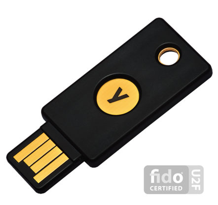

Using a Yubikey For U2F
#######################

..  _FreeOTP:   https://freeotp.github.io/
..  _U2F:       https://en.wikipedia.org/wiki/Universal_2nd_Factor
..  _Yubikey:   https://www.yubico.com/

Your first question is "What is U2F_", and why do I want to use it. Your second
question is "What is a Yubikey?

U2F
***

Simple username and password authentication is too easy to crack. Humans pick
pathetic passwords, and use one password on many sites. The result is that
comprimising one site potentially opens you up to attack on many sites. I have
had my credit card and SSAN used by unautorized crooks to buy toys in L.A, and
to file a false Income Tax refund return. My trust in just about anyone "out
there" is gone.

I started doing research intomore secure ways to protect my
personal accounts, and U2F_ seemed to be the answer. Many public systems are using
this scheme, so getting going with U2F_ seemed like a good idea.

U2F_ is a "two factor" security system.The two factors are "something you
know" (like a username and password), and "something you have" (like a special
one-time use code you type into a screen, or a hardware device you need to plug
into your computer).

The   addition of the second factor means that if someone manages to get your
username and password, they still cannot get into your accounts because they
will not have that "something you have" part. They need both parts, and
the likelihood that they will have both is very small.

The U2F_ system still uses the conventional username and password system.

"Something You Have"
********************

You certainly have a smartphone. One way to provide the second part of U2F_
involves that device:

Smart Phone App
===============

Some U2F_ systems use an "app" on your phone to generate a code you type in
each time you want access to an account protected by the system. A popular
"app" is FreeOTP_, available for both iPhone and Android devices. Any site you
want to set up U2F security on will need to be registered on this app, and once
that has been done, a login attempt will generate a web form where you enter
the special code, which is generated and displayed on your phone.

Yubikey
=======

A Yubikey_ is a small hardware device that plugs into the USB connectoron your
computer. These gadgets are designed to be attached to your keychain.

This hardware device (there are several models) generates a one-time code that
is sent to the Yubikey_ server. If the key has been registered, that server
creates the security code and forwards it to the web site you are accessing. It
is automatic and ll you need to doisplugin the device and touch it (it uses a
finger touch to trigger the action).

Pretty simple, but you dohave to keepthekeys near your system. Unfortunately,
working in a secure environment requires this kindof thing. (Trust me, I know,
basedon my previous career in the USAF!)

