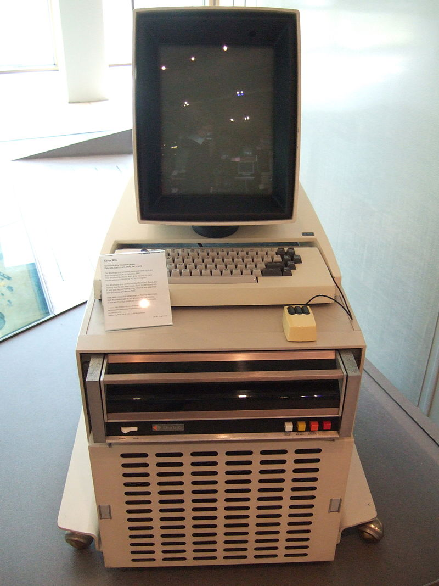

Working on the Command Line
###########################

In this class, you will not spend much of your time working with the mouse in one hand. Instead, we will learn how to manage your system and development activities using just the keyboard.

Why?

Modern software is not developed solely on your friendly Windows platform, and
not everything can be done using the mouse. For some of you the mere thought of
letting go of that friendly object strikes you with fear.

Fear not! I actually had the opportunity to put my hands on the first mouse
which came with the first machine that used this critter for anything. The
machine was a Xerox Alto, which I saw at Carnegie Mellon University in the
1970's.

..  note::

    The normal screen was paper-white (what else would you expect from Xerox?)
    and the cursor was a little guy on skis. People would grab the mouse and 
    make him ski down the screen. It was entertaining!

Then Steve and Bill got a look at this machine, and the rest is history.

Before the Alto, all we used to control the computer, or write software, was a
keyboard. We can still do that, but we do so using a special program called the
"shell" or "terminal" on Linux and Mac, and the "command-prompt" window on
Windows.  

This is an important skill for a developer. There will be times when the system
you need to work on simply does not have a graphical interface, and your only
way to deal with that machine will be using the command line.

..  note::

    The term "command line" comes from a line where you type in a "command" to
    the operating system. That command directs the system to do something, and
    usually results in some program running on the system. What that program is
    depends on what you need at the moment.

..  vim:ft=rst spell:
