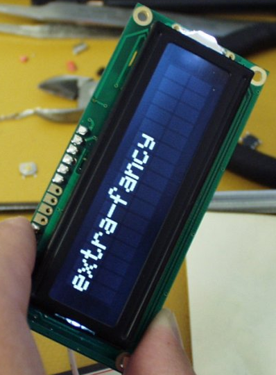

..  _16x2-lcd-display:

16x2 LCD Display
################

..  include::   /references.inc

These devices are used for all kinds of consumer products to display short
messages. The display is capable of showing 16 characters on each of two lines,
making it pretty versatile. You can even program the characters to be displayed
allowing simple graphics to be displayed. This device can be controlled by most
controller boards. There are many such displays on the market, so the exact one
provided depends on what I have working at the time we do this project.

