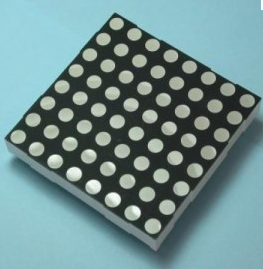
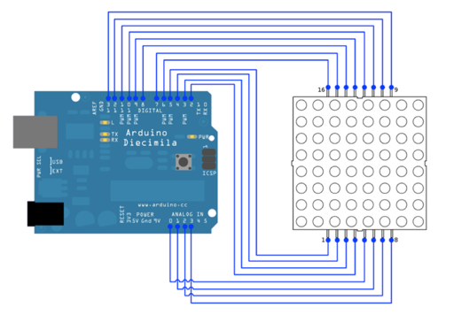

..  _8x8led:

8x8 LED Display
###############

..  include::   /references.inc

This device is similar to those found in devices that scroll text or display
messages on small gadgets. (The time/message board in our classroom uses a
number of these devices). 

With 64 LEDs to light up, you might think that controlling the display is hard.
In fact, we rely on a trick to make it happen. Basically only one row (or
column) at a time is enabled, and we use an 8-bit code to decide which of the 8
LEDs on the row will light up. Then we switch to another row and do the same
thing for that row. If we cycle the rows fast enough, our eyes think all the
lights can be on at one time. 

This device is ideal for an Arduino_ controller board.

Here is a datasheet for the device I have. You need to be careful when looking
at wiring diagrams for an 8x8 device, they may not have the same wiring
connections shown here. Also not that there are two different models of the
device. If you wire it one way the LEDs will not light, if that happens, use
the opposite diagram as your wiring guide. The only difference is which side of
the LED needs to be +5 and which side needs to be ground.

..  download:`TA23-EWA.pdf`

Here is an example wiring diagram for an Arduino driving this device. You
really should have resistors in the circuit so no path from +5 to GND goes
through an LED without also going through the resistor I have provided 8
resistors with each project kit.

