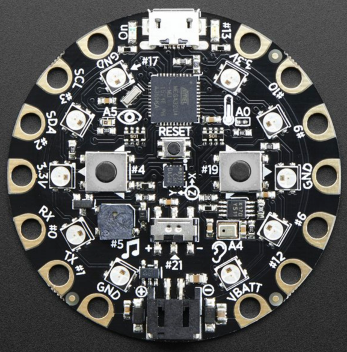

..  _adafruit-circuit:

Adafruit Circuit playground
###########################

This device is an AVR system with a few components on it, designed to be used
as an ointroduction into small computer systems and programming. You do not
need to write all the cod eoin assembly language for this project. Just picck
one of the devices on the board, and create a fgunction that controls that
device in assembly. The rest of the code can be written in C/C++ as you wish.

