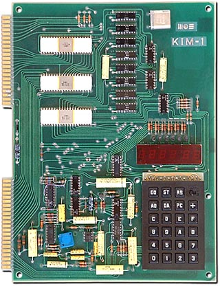
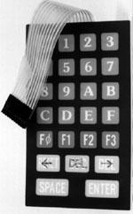

..  _membrane-keypad:

Membrane Keypad
###############

..  include::   /references.inc

My first personal computer was a Kim-1, purchased around 1975 for $250. The
board has an 8-bit processor, 1k bytes of RAM, and a nice little hex-keypad to
punch in code. This was a neat little board, and I wish I had kept it:

I have kept watch for a keypad similar to the one on the Kim-1, and finally
found this one in an electronics supply house in Dallas:

This keypad is designed to be stuck to some surface with an adhesive tape, and
the connector provides access tot he switch elements. Interfacing this with
something like an Arduino_ is pretty simple. Here is a link to a site selling
these keypads:

    * `Experimenter's Keypad <http://www.bgmicro.com/ACS1048.aspx>`_

And here is a link to an Arduino_ project that uses this keypad:

    * `25 Key Membrane Keypad <http://www.rasmicro.com/25_keypad+Arduino.htm>`_

