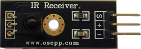
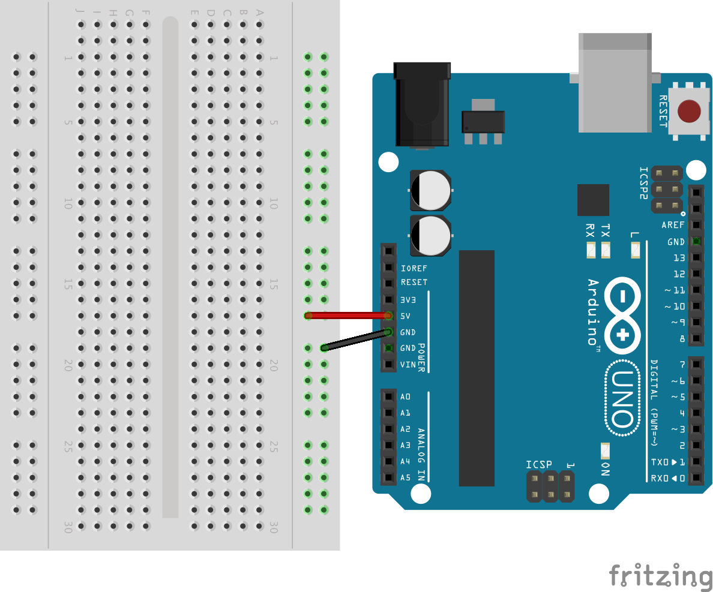

..  _ir-decoder:

IR Decoder
##########

..  include::   /references.inc

Every home has a bunch of TV remote controls around. (Why we need so many is a
topic for another day!) This project will use a simple IR decoder device to
read the pulses transmitted by these remotes as you push each button. 

Parts Inventory
***************

To complete this project, you need the following parts:

    * Arduino board
    * IR Decoder (OSEPP IR Receiver from Fry's)
    * Breadboard
    * Three jumper wires

Here is an image of the detector:

Schematic Diagram
*****************

Here is the basic schematic you will use to set this project up:

    
