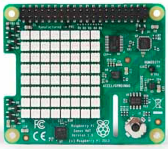

..  _pi3-sense-hat:

Raspberry Pi3 Sense hat
#######################

This board is a simple add-on for the PI3 with several devices on it:

    * 8x8 LED matrix Display 
    
    * Accelerometer 
    
    * Gyroscope and megnetometer
    
    * Air pressure sensor 
    
    * Temperature and humidity sensor. 
    
    * Small joystick

You do not need to use all of these devices, but at least one must be driven by
an assembly language function you create. Your function can interface with
C++ or python code to complete your demonstration.

..  warning::

    We will not be going over ARM assembly language in class. You can use the
    g++ compiler (for the arm of curse) to see the code using the scheme we use
    din class for the apentium. There are references on the INternet, and I can
    loan a book on arm assemby language if needed.

