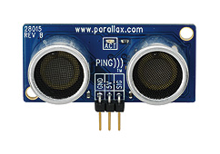

..  _sonar-obstacle-detector:

Sonar Obstacle Detector
#######################

..  include::   /references.inc

This device is an ultrasonic sound generator and detector. Basically, the
device emits a pulse of sound which travels at about 750 MPH away from the
device When that sound pulse hits an obstacle, it bounces (echoes) and returns
to the detector. You measure the time it takes for the sound to return and
calculate how far away the obstacle is. The device is called a "ping" sensor:

    * Ping Sensor <ref: http://www.parallax.com/tabid/768/ProductID/92/Default.aspx>`_

Here is the device:

Recommended controllers:

    * Arduino_
    * Teensy_
    * RaspberryPI_

