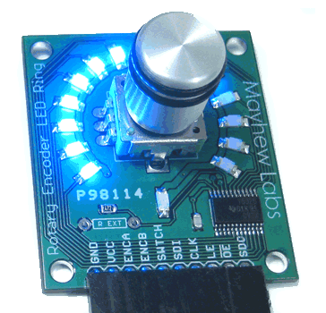

..  _rotary-encoder:

Rotary Encoder LED Ring
#######################

..  include::   /references.inc

This device is much like the controls found in modern radio devices where a
know it turned one direction or another to alter the tuning frequency. This
device also sports a ring of LED lights that can be programmed to follow the
motion of the knob. 

The actual device is:

    * `Mayhew Labs Rotary Encoder
      <http://mayhewlabs.com/news/new-product-rotary-encoder-led-ring>_`

    
