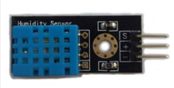

..  _temp-humidity:

Temperature/Humidity Sensor
###########################

..  include::   /references.inc

This device is a a simple sensor capable of measuring temperatures between 0 and 50 degrees Celcius, and relative humidity between about 20% and 90%. This might be fine for a simple weather station.

The board is designed to mount on a breadboard, and from there, you can provide three signals: power, ground, and a signal line. 

